## Wenn der Screen Reader verstummt

Stell dir vor, du beginnst deinen Tag wie viele andere: Du öffnest die Nachrichten-App und scrollst durch die Schlagzeilen. Doch statt zu lesen, hörst du. Ein Screen Reader liest dir vor, was auf dem Bildschirm steht. Du kommst zu einem Artikel über die Inflation in der Schweiz. Der Text ist informativ — und dann ist da diese Grafik, die alles auf einen Blick zeigen würde. Doch der Screen Reader verstummt. Oder sagt nur: «Grafik».

In der Schweiz leben [über 377'000 Menschen](https://www.szblind.ch/fileadmin/pdfs/Forschung/Forschungsberichte/SZBLIND_-_Sehbehinderung_..._Entwicklung_in_der_Schweiz_-_Berechnungen_2019_bf.pdf) mit einer Sehbehinderung, Blindheit oder Hörsehbehinderung. Etwa 50'000 davon sind blind, die übrigen verfügen über ein eingeschränktes Restsehvermögen. Mit der demografischen Alterung wächst diese Zahl jedes Jahr — bemerkenswert ist auch, dass über 70 Prozent ihre Sehbehinderung erst im Erwachsenenalter erworben haben.

Für viele dieser Menschen ist der [E-Kiosk](https://sbv-fsa.ch/publikationen-und-apps/apps/e-kiosk/) des Schweizerischen Blinden- und Sehbehindertenverbands (SBV) die zentrale Anlaufstelle für tagesaktuelle Informationen. Über 70 Zeitungen und Magazine sind dort in zugänglichem Format verfügbar — die NZZ ist eine davon. Aber: Visuelle Inhalte fehlen vollständig. Wer auf eine herkömmliche Online-Zeitung ausweicht, findet zwar Bilder und Charts, aber meist nur eine Caption darunter — und die ist für sehende Leserinnen und Leser geschrieben. Sie ergänzt das Bild, ersetzt es aber nicht.

Genau hier setzte unser Challenge-X-Projekt an der FHNW an. Gemeinsam mit der NZZ und dem SBV haben wir ein Semester lang untersucht, wie weit Sprachmodelle (LLMs) heute beim automatischen Generieren von Alt-Texten für Charts kommen — und wo sie an Grenzen stossen.

<figure style="max-width: 550px; margin: 0 auto 1.5em;">
  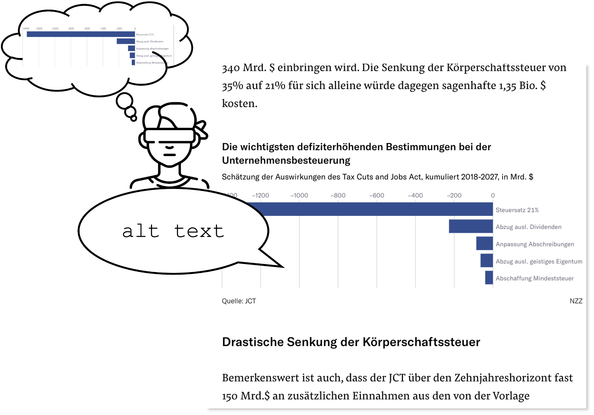
</figure>

## Lesen ohne Augen — und was dabei verloren geht

Bevor wir uns den technischen Teil anschauen, lohnt es sich kurz zu verstehen, wie blinde und sehbehinderte Personen digitale Inhalte überhaupt konsumieren. Die wichtigste Technologie sind sogenannte Screen Reader — Programme wie JAWS oder VoiceOver, die Bildschirminhalte in Sprache umwandeln. Sie lesen nicht nur Texte vor, sondern beschreiben auch die Struktur einer Webseite: Überschriften, Listen, Buttons, Links.

Eine Ergänzung zum Screen Reader sind Braille-Displays. Diese Geräte stellen Text taktil dar, indem kleine Stifte sich heben oder senken und so Braille-Zeichen formen. Wer Braille flüssig liest, kann darüber Text fast wie mit den Augen «scannen» — vor- und zurückspringen, sich orientieren. Allerdings nutzt nicht jede sehbehinderte Person ein Braille-Display: Wer im Erwachsenenalter erblindet, lernt Braille oft nicht mehr fluent. Audio bleibt dann der einzige Zugang.

Ein zentraler Unterschied zu sehenden Lesenden: Audio ist sequenziell. Wer hört, bekommt Information Wort für Wort — anders als beim Sehen, wo wir auf einen Blick eine ganze Seite überfliegen können. Genau das macht Charts zur Herausforderung. Ein Liniendiagramm vermittelt sehenden Personen sofort einen Eindruck von Trend, Spitzen und Tiefpunkten. Über Audio muss diese Information erst sequenziell aufgebaut werden — das verlangt mehr kognitive Anstrengung und stellt höhere Anforderungen an die Beschreibung.

Hier kommen Alt-Texte ins Spiel — und es lohnt sich, sie sauber von Captions zu unterscheiden. Eine Caption ist der sichtbare Text unter einem Bild oder Chart, lesbar für alle. Ein Alt-Text dagegen ist unsichtbar im HTML hinterlegt und wird ausschliesslich von Screen Readern vorgelesen. Beide ergänzen sich — die Caption gibt den sehenden Kontext, der Alt-Text ersetzt das visuelle Erlebnis. Eine gute Caption kann den Alt-Text nicht ersetzen, weil sie nicht für die nicht-visuelle Verarbeitung geschrieben ist.

Heute fehlen Alt-Texte bei Charts in der Praxis fast überall. Die NZZ liefert für ihre Charts keine — und ist damit kein Sonderfall, sondern Norm.

## Was ein guter Chart-Alt-Text leisten muss

Die Web Content Accessibility Guidelines (WCAG 2.2) regeln, wie Webinhalte zugänglich gemacht werden müssen. Für Charts gilt [Technique G95](https://www.w3.org/WAI/WCAG22/Techniques/general/G95.html) unter Guideline 1.1.1: Non-text Content. Sie verlangt, dass nicht-textliche Inhalte über Textalternativen vermittelbar sind, und unterscheidet zwischen einer kurzen und einer langen Beschreibung. Die kurze Beschreibung gibt eine schnelle Orientierung, die lange enthält die vollständige Information des Charts.

Konkret nennen die Guidelines allerdings nur ein einziges Beispiel:

> *A chart showing sales for October has a short text alternative of «October sales chart.» The chart also has a long description that provides all of the information on the chart.*

Wie eine solche lange Beschreibung aussieht — wie viel Detail nötig ist, ob Werte exakt oder gerundet, ob Trends oder einzelne Datenpunkte priorisiert werden sollen — bleibt offen. Mit dem Inkrafttreten des [European Accessibility Act (EAA)](https://eur-lex.europa.eu/eli/dir/2019/882/oj/eng) im Juni 2025 hat sich diese Lücke verschärft: Aus einer Empfehlung wurde eine gesetzliche Pflicht.

Auf Basis bestehender Forschung (vor allem [Jung et al. 2022](https://doi.org/10.1109/TVCG.2021.3114846) und [Belle et al. 2022](https://doi.org/10.5220/0010994600003176)) und unserer eigenen Vorarbeit haben wir ein dreistufiges Strukturmodell entwickelt:

<figure style="max-width: 550px; margin: 0 auto 1.5em;">
  
</figure>

Die Kurzbeschreibung enthält zwei Teile: zuerst die Metadaten (Diagrammtyp, Titel, Achsenbeschriftungen, Wertbereich), dann einen kurzen Überblick über die Hauptaussage. Erst danach folgt die lange Beschreibung mit Details zu Trends, Vergleichen und Extremwerten. Optional ergänzt eine maschinenlesbare Datentabelle das Ganze.

Diese Trennung ist wichtig, weil lange Beschreibungen über einen Screen Reader nicht überspringbar sind, sobald die Wiedergabe gestartet hat. Lesende sollen vorab entscheiden können, ob sie den vollen Text oder nur die Hauptaussage hören möchten.

## Die Datenbasis: NZZ-Charts

Die NZZ stellte uns 168 Charts mit zugehörigen JSON-Metadaten und PNG-Renderings zur Verfügung. Wir haben den Scope auf die drei häufigsten Diagrammtypen begrenzt: Linien-, Balken- und gestapelte Balkendiagramme. Damit blieben 150 Charts in unserer Analyse.

Innerhalb jedes Typs unterscheiden wir zwischen «simplen» und «komplexen» Charts. Diese Unterscheidung ist nicht ästhetisch, sondern strukturell: Ein simpler Chart enthält eine einzige Datenreihe, ein komplexer Chart zwei oder mehr.

Linien-Charts zeigen immer Zeitreihen auf der x-Achse. Simpel: eine Linie. Komplex: mehrere Linien, etwa ein Vergleich verschiedener Indizes über die Zeit.
<figure style="margin: 0 auto 1.5em; max-width: 800px;">
  

    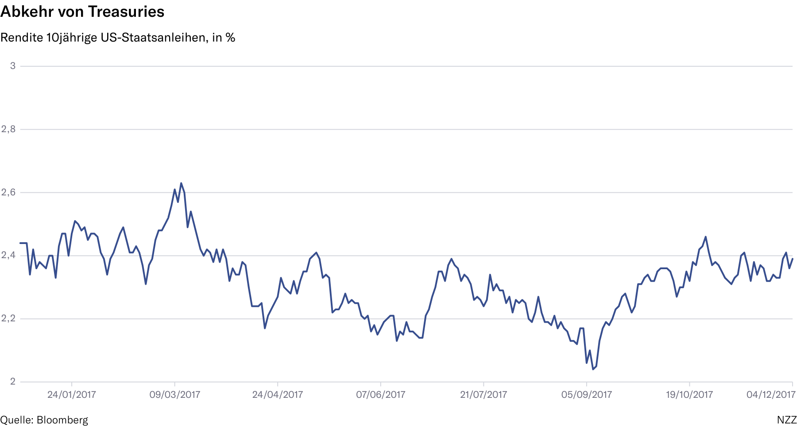
    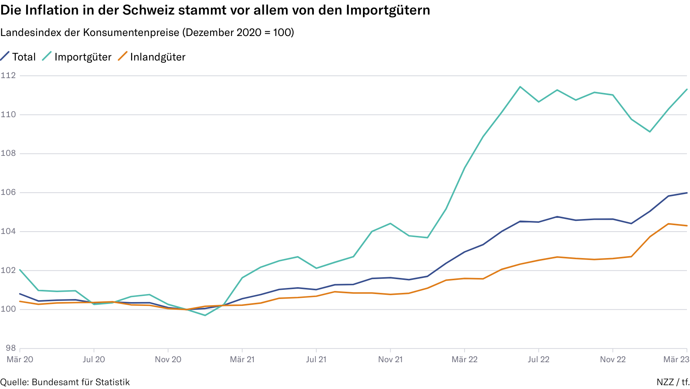
  

</figure>

Balken-Charts können horizontal oder vertikal sein und zeigen entweder Zeitreihen oder kategorische Daten. Komplexe Varianten kombinieren beispielsweise mehrere Kategorien innerhalb einer Zeitreihe oder eines Vergleichs.

<figure style="margin: 0 auto 1.5em; max-width: 800px;">
  

    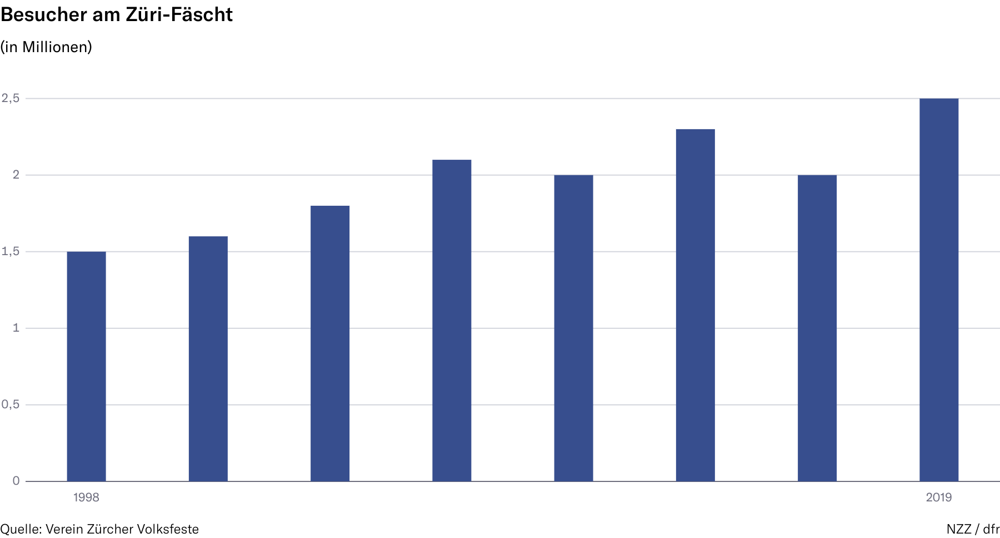
    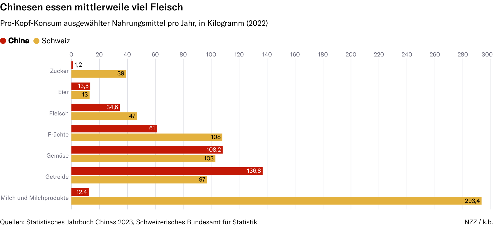
  

</figure>

Gestapelte Balken-Charts zerlegen einen Wert in seine Bestandteile — entweder mit absoluten Werten oder als 100-Prozent-Darstellung.

<figure style="margin: 0 auto 1.5em; max-width: 800px;">
  

    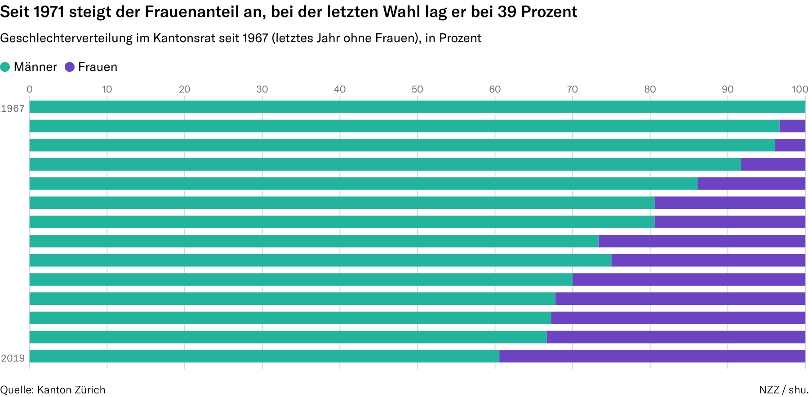
    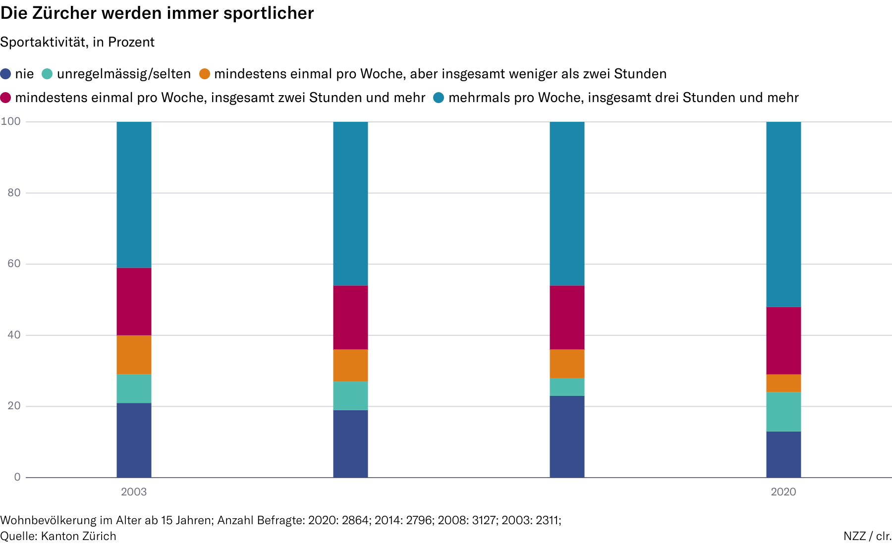
  

</figure>

Hinzu kommen visuelle Encodings, die für Alt-Texte besonders herausfordernd sind: Highlights (etwa farblich hervorgehobene Balken), Prognosen (gestrichelte Linien) und Events (vertikale Marker mit Beschriftung). Diese tragen zentrale Informationen — und müssen explizit beschrieben werden, sonst verschwindet die Aussage des Charts.

Nach dem Preprocessing landeten alle Daten in einer relationalen Datenbank, die als gemeinsame Grundlage für Generierung, Speicherung und Evaluation diente.

## Gold-Standards: Manuell schreiben, was eigentlich automatisch entstehen soll

Bevor wir Alt-Texte automatisch generieren konnten, brauchten wir eine Referenz. Im Vorgängerprojekt hatten wir Statistas Open-Source-Datensatz verwendet — und festgestellt, dass er als Gold-Standard nicht taugt: Die Texte trennen nicht zwischen Kurz- und Langbeschreibung, lassen Metadaten oft weg und mischen Inhalte aus dem Chart mit externen Erklärungen. Also haben wir 41 Gold-Standards selbst geschrieben — ausgewählt nach Chart-Typ, Komplexität und visueller Vielfalt.

Der Prozess verlief in drei Iterationen.

**Version 1.** Erste Entwürfe basierend auf der Prompt-Struktur des Vorgängerprojekts. Wir haben uns dabei einen methodischen Trick erlaubt: Eine Person schrieb den Alt-Text, die andere skizzierte das Chart nur anhand des Textes. Wo sich die Skizze stark vom Original unterschied, war der Text unzureichend.

**Version 2.** Linguistische Konsultation mit Dr. Monique Honegger (EHB Zürich). Ihr Feedback war konsequent: weniger Zahlen, mehr Übersicht. Statt jeder einzelne Wert zählt der Trend. Ausserdem strikte Neutralität — keine wertenden Verben wie «einbrechen» oder «erholen», sondern nur «steigen», «sinken» und «zeigen». Das mag nüchtern klingen, ist aber zentral: Was für eine sehende Person eine harmlose Beschreibung ist, kann für eine blinde Person, die den Chart nicht selbst beurteilen kann, eine unnötige Wertung sein.

**Version 3.** Interviews mit fünf sehbehinderten und blinden Personen. Sie haben unsere Texte mit ihren eigenen Screen Readern angehört und ausführlich Feedback gegeben. Daraus ergaben sich klare Präferenzen, die wir vorher nicht antizipiert hatten.

Wie stark sich ein Alt-Text durch diese drei Iterationen verändert, zeigt das Beispiel der Treasuries-Grafik aus dem vorigen Abschnitt. So sah die lange Beschreibung in Version 1 aus:

> *Die Rendite bewegt sich ohne klaren Trend mehrfach auf und ab. Ende Januar liegt die Rendite bei 2,4 % und steigt bis Anfang März auf 2,63 %, den höchsten Wert des Jahres. Mitte April fällt sie auf 2,2 %. Von Mai bis August schwankt sie zwischen 2,2 % und 2,4 %. Anfang September wird mit 2,04 % der Tiefpunkt erreicht. Danach steigt sie an und erreicht im Oktober 2,46 %. Bis anfangs Dezember schwanken die Werte um die 2.35%.*

Faktisch korrekt — aber kognitiv überladen. Sieben exakte Werte mit zwei Nachkommastellen, das überfordert beim Hören. Nach den Interviews mit den sehbehinderten und blinden Personen sah dieselbe Stelle so aus:

> *Überblick: Die Rendite sinkt bis im Herbst 2017 mit Schwankungen und steigt bis Ende Jahr auf das Anfangsniveau.*
>
> *Lange Beschreibung: Anfangs Januar 2017 liegt die Rendite bei rund 2.4 Prozent und steigt bis Mitte März auf den Jahreshöchststand von gut 2.6 Prozent. Anschliessend sinkt sie mit mehreren Zwischenanstiegen bis Anfang September auf den Tiefpunkt von gut 2 Prozent. Danach steigt sie bis Jahresende auf rund 2.4 Prozent.*

Drei Findings haben uns am meisten überrascht. Erstens bevorzugten die Teilnehmenden «waagrecht» und «senkrecht» statt «x-Achse» und «y-Achse». Beide Varianten sind technisch korrekt, aber die räumliche Beschreibung ist kognitiv weniger anstrengend, gerade für Personen, die später erblindet sind und sich noch an die räumliche Vorstellung erinnern. Zweitens: Bullet Points statt Prosa für Metadaten. Eine modulare Struktur («Titel: …; Waagrechte Achse: …») lässt sich mit dem Screen Reader gezielter ansteuern als ein langer Fliesstext. Drittens: Konkrete Zeitanker statt vager Formulierungen. «Mitte März 2017» statt «irgendwann im Frühjahr». Eine Teilnehmerin sagte direkt: «Das *irgendwann* würde ich gerne wissen.»

Aus diesen drei Iterationen entstanden nicht nur die 41 Gold-Standards selbst, sondern auch ein konsolidierter Guideline-Katalog: chartspezifische Regeln, wann welche Information zu welcher Sektion gehört, welche Verben verwendet werden, wie mit Markierungen umzugehen ist. Dieser Katalog wurde zur Grundlage für die nächste Phase.

## Vom Gold-Standard zum Prompt

Mit den Guidelines im Rücken haben wir sechs chartspezifische Prompts entwickelt — einen pro Kombination aus Chart-Typ und Komplexität. Jeder Prompt folgt derselben Blueprint-Struktur aus fünf Blöcken:

1. **Aufgabendefinition** mit den drei Sektionen Kurzbeschreibung, Überblick und lange Beschreibung — inklusive expliziter Wortlimits (50 Wörter für simple Charts, 90 für komplexe).
2. **Beispiele** aus unseren Gold-Standards — Few-Shot-Learning, das dem Modell zeigt, wie ein guter Text aussehen soll.
3. **CSV-Datenauszug** des konkreten Charts.
4. **Stilregeln**: nur «steigen» und «sinken» als Trendverben, «minus» ausgeschrieben statt als Symbol (Screen Reader lesen das Minuszeichen sonst als Bindestrich), Schweizer Zahlennotation mit Apostroph (300'000).
5. **Fixes Output-Format**, sodass die generierten Texte automatisch in Sektionen geparst werden können.

Für die Generierung haben wir Gemini 2.5 Flash über OpenRouter angesprochen. Das Modell akzeptiert sowohl Text- als auch Bildinput — wir übergeben also den Prompt mit den CSV-Daten zusammen mit dem Chart-Bild. Pro Chart haben wir jeweils zehn Varianten generiert (mit Temperature 0.4, 1.0 und 1.6), um Variabilität und den Effekt verschiedener Generierungsparameter analysieren zu können. Insgesamt entstanden so 810 generierte Alt-Texte über 27 Benchmark-Charts.

## Wie wir die generierten Texte bewertet haben

Eine einzelne Evaluationsmethode reicht für Alt-Texte nicht aus. Jede hat blinde Flecken: Menschen skalieren nicht gut, Embedding-Metriken erfassen keine Struktur, und LLMs als Bewerter haben eigene systematische Verzerrungen. Wir haben deshalb drei komplementäre Perspektiven kombiniert.

**Menschliche Evaluation.** Die fünf Interviewpartner aus der Gold-Standard-Erstellung haben auch generierte Texte bewertet — auf einer Likert-Skala für Klarheit, Kürze, Neutralität und gefühlte Vollständigkeit. Diese Daten sind klein in der Stichprobe, aber qualitativ unersetzlich.

**SBERT-Cosine-Similarity.** Für jeden generierten Text haben wir die semantische Nähe zum entsprechenden Gold-Standard berechnet. Die Methode hat einen klaren Vorteil — sie skaliert auf hunderte Texte — und einen klaren Nachteil: Sie misst Bedeutungsähnlichkeit, aber keine Strukturkonformität. Zwei Texte können semantisch nah sein und trotzdem in völlig unterschiedlicher Form vorliegen.

**LLM-as-a-Judge.** Wir haben OpenAIs o4-mini eingesetzt, um die generierten Texte nach sechs Kriterien zu bewerten: Klarheit, Vollständigkeit, Kürze, gefühlte Vollständigkeit, Korrektheit und Neutralität. Pro Kriterium ein eigener Prompt, mit expliziter Anweisung gegen typische Bias-Muster (Verbosity, Authority, Position). Die Methode ist nicht perfekt — wie wir noch sehen werden, neigt sie zu strengeren Conciseness-Bewertungen als Menschen — aber sie macht systematische Vergleiche erst möglich.

Erst im Mix dieser drei Perspektiven entsteht ein belastbares Bild.

## Was wir gelernt haben

Drei Erkenntnisse haben uns am meisten überrascht.

**Erkenntnis 1: Metadaten gehören nicht ins LLM.**

Die Kurzbeschreibung mit Diagrammtyp, Titel, Achsen und Wertbereich ist deterministisch — sie steht direkt in den Chart-Metadaten. Trotzdem haben wir sie zunächst vom LLM mitgenerieren lassen, weil es einfacher war. Das Resultat: längere Texte als nötig, gelegentliche Halluzinationen (Achsen-Werte, die nicht im Original stehen) und unnötige Variation zwischen Generierungs-Durchläufen. Templates sind hier strikt besser. Ein LLM bringt erst dort Mehrwert, wo abstrahiert und priorisiert werden muss — beim Überblick und der langen Beschreibung. Diese Erkenntnis war für uns die wichtigste praktische Schlussfolgerung des Projekts.

**Erkenntnis 2: LLMs sind verbose — und Kürze lässt sich kaum erzwingen.**

Selbst mit expliziten Wortlimits im Prompt produzierten die LLM-Texte durchgängig längere Beschreibungen als unsere Gold-Standards. Bei komplexen Charts war der Effekt am stärksten. Höhere Temperature-Werte verschärften ihn zusätzlich.

<figure style="max-width: 550px; margin: 0 auto 1.5em;">
  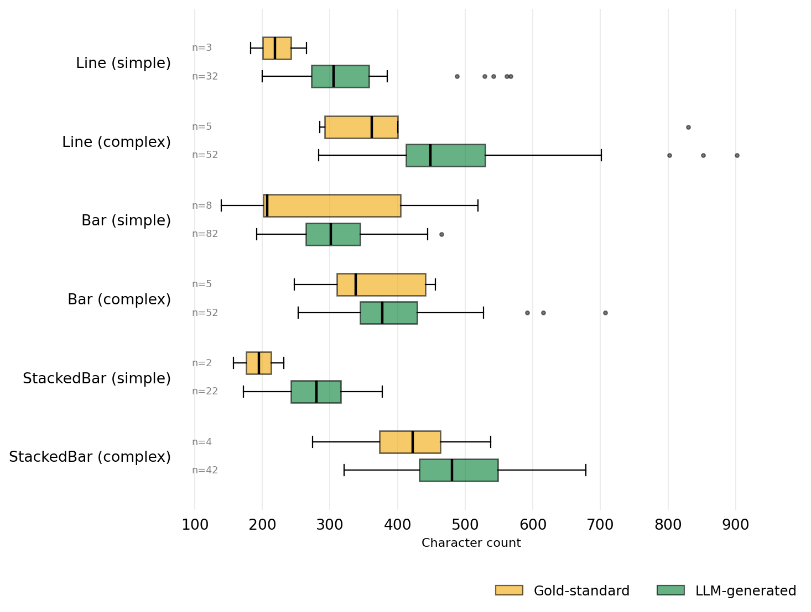
</figure>

Interessant dabei: Die interviewten Personen bewerteten Vollständigkeit oft besser bei längeren Texten — aber Kürze gleichzeitig schlechter. Das LLM-as-a-Judge war strenger und vergab niedrigere Conciseness-Scores. Das deckt sich mit dem qualitativen Feedback der Interviews: «Pseudo-Präzision» wie 2.54 Prozent statt rund 2 Prozent wurde explizit als kognitiv anstrengend genannt. Die Lehre: Wortlimits allein reichen nicht. Es braucht Stilregeln, die Aggregation und Rundung explizit fordern.

**Erkenntnis 3: Komplexe Charts bleiben hart — auch wenn der Text korrekt ist.**

Bei einfachen Charts erreichten die LLM-Texte fast die Qualität der Gold-Standards. Bei komplexen Charts mit fünf oder mehr Datenreihen jedoch berichteten alle Interviewpartner durchgängig von hoher kognitiver Last. Eine Teilnehmerin formulierte es so: «Selbst wenn ich die Tabelle hätte, würden mir diese Muster vermutlich nicht auffallen.» Das ist kein reines LLM-Problem — es ist ein Limit der seriellen Audio-Verarbeitung. Eine sehende Person erfasst zehn Linien auf einen Blick. Über Audio sind zehn Linien nicht «auf einen Blick» beschreibbar, egal wie gut die Beschreibung ist.

Daraus ergibt sich eine wichtige praktische Konsequenz: Chart-Komplexität ist nicht nur ein technisches Problem, sondern auch eine redaktionelle Frage. Wer Inhalte zugänglich machen will, sollte bei der Chart-Wahl bereits an die Vermittlung in Audio mitdenken.

## Beispiele: Wo es klappt, wo es scheitert

Jetzt zu den konkreten Texten. Zwei Beispiele, bei denen die LLM-Generierung grundsätzlich gelingt — und zwei, bei denen sie deutlich schwächer abschneidet. Die Auswahl zeigt auch: SBERT-Similarity und LLM-Judge-Scores stimmen nicht immer überein.

### Beispiel 1 — Pro-Kopf-Konsum Schweiz vs. China (gelungen)

  <figure style="flex: 0 0 55%; margin: 0;">
    
  </figure>
  

    
SBERT: 0.95

    
LLM-Judge (1–5):

    <ul>
      <li>Klarheit: 2</li>
      <li>Vollständigkeit: 3</li>
      <li>Kürze: 1</li>
      <li>Gefühlte Vollständigkeit: 2</li>
      <li>Neutralität: 4</li>
      <li>Korrektheit: 2</li>
    </ul>
  

**Gold-Standard (lange Beschreibung):**

> *Pro-Kopf-Konsum in Kilogramm pro Kategorie. Zucker: China 1,2, Schweiz 39. Eier: China 13,5, Schweiz 13. Fleisch: China 34,6, Schweiz 47. Früchte: China 61, Schweiz 108. Gemüse: China 108,2, Schweiz 103. Getreide: China 136,8, Schweiz 97.*

**LLM-generiert (lange Beschreibung):**

> *Der Pro-Kopf-Konsum von Milch und Milchprodukten beträgt in der Schweiz 293,4 Kilogramm, verglichen mit 12,4 Kilogramm in China. China konsumiert mehr Getreide (136,8 kg) als die Schweiz (97 kg), und auch mehr Gemüse (108,2 kg gegenüber 103 kg). Der Fleischkonsum ist in China mit 34,6 Kilogramm niedriger als in der Schweiz mit 47 Kilogramm. Bei den Eiern liegt China mit 13,5 Kilogramm leicht über der Schweiz mit 13 Kilogramm. Beim Zuckerkonsum dominiert die Schweiz mit 39 Kilogramm den Vergleich zu 1,2 Kilogramm in China.*

**Einschätzung:** Kurzbeschreibung und Overview sind in beiden Versionen fehlerfrei. Bei der langen Beschreibung zeigt sich jedoch ein Muster, das wir mehrfach gesehen haben: Wenn Zahlenreihen stark unterschiedlich sind — hier von 1,2 bis 293,4 Kilogramm — ist eine technische Aufzählung effizienter als Fliesstext. Die LLM-Variante verpackt denselben Inhalt in deutlich mehr Prosa. Der hohe SBERT-Score (0.95) reflektiert, dass die Inhalte semantisch fast identisch sind. Der LLM-Judge urteilt dagegen bei Kürze streng (1/5) — passend zu dem, was wir in Erkenntnis 2 beschrieben haben.

### Beispiel 2 — Luft- und Wassertemperatur Zürich (gelungen)

  <figure style="flex: 0 0 55%; margin: 0;">
    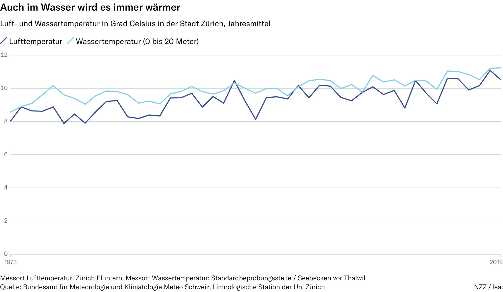
  </figure>
  

    
SBERT: 0.92

    
LLM-Judge (1–5):

    <ul>
      <li>Klarheit: 5</li>
      <li>Vollständigkeit: 5</li>
      <li>Kürze: 1</li>
      <li>Gefühlte Vollständigkeit: 5</li>
      <li>Neutralität: 5</li>
      <li>Korrektheit: 5</li>
    </ul>
  

**Gold-Standard (Overview):**

> *Beide Temperaturreihen steigen im Verlauf mit Schwankungen von maximal 2 Grad Celsius. Die Wassertemperatur verläuft meistens leicht über der Lufttemperatur und schwankt weniger stark.*

**LLM-generiert (Overview):**

> *Während die Wassertemperatur meist höher liegt, zeigt sie generell weniger Schwankungen als die Lufttemperatur. Im Zeitverlauf steigen beide Temperaturen, wobei die Wassertemperatur tendenziell leicht stärker zunimmt. Phasenweise sinken die Lufttemperaturen unter die Wassertemperaturen ab.*

**Einschätzung:** Inhaltlich überzeugt die LLM-Version — der Judge vergibt fast durchgehend 5/5. Zwei Detailunterschiede sind trotzdem bezeichnend. Erstens: Die Note am Chart-Rand mit den Messorten (Zürich Fluntern für Luft, Seebecken vor Thalwil für Wasser) fehlt in der Kurzbeschreibung. Das Modell hat diese Information schlicht nicht erfasst. Zweitens: Der Overview ist länger als der des Gold-Standards, aber gleichzeitig weniger konkret. «Tendenziell leicht stärker zunimmt» ist schwächer als die Angabe «Schwankungen von maximal 2 Grad Celsius». Das illustriert eine typische LLM-Tendenz — mehr Wörter, aber nicht mehr Information.

### Beispiel 3 — Bevölkerungsprognose 2100 (problematisch)

  <figure style="flex: 0 0 55%; margin: 0;">
    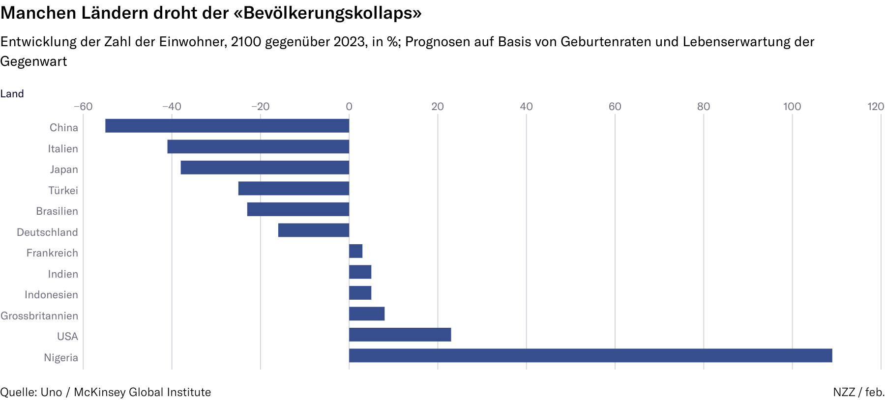
  </figure>
  

    
SBERT: 0.64

    
LLM-Judge (1–5):

    <ul>
      <li>Klarheit: 4</li>
      <li>Vollständigkeit: 2</li>
      <li>Kürze: 1</li>
      <li>Gefühlte Vollständigkeit: 4</li>
      <li>Neutralität: 3</li>
      <li>Korrektheit: 5</li>
    </ul>
  

**Gold-Standard (lange Beschreibung):**

> *China: Prognose Minus 55 %. Italien, Japan: Je etwa minus 40 %. Türkei, Brasilien, Deutschland: Je etwa minus 20 %. Frankreich, Indien, Indonesien, Grossbritannien: 3 % bis 8 %. USA: 23 %. Nigeria: 109 %.*

**LLM-generiert (lange Beschreibung):**

> *Die Bevölkerung sinkt in China um 55 Prozent, in Italien um 41 Prozent und in Japan um 38 Prozent. Deutschland verzeichnet einen Rückgang von 16 Prozent. Frankreich und Indien weisen ein leichtes Wachstum von respektive 3 und 5 Prozent auf. Die USA wächst um 23 Prozent und Nigeria mit 109 Prozent am stärksten.*

**Einschätzung:** Dieses Beispiel ist methodisch besonders spannend. Der SBERT-Score ist mit 0.64 einer der niedrigsten im Datensatz — aber der LLM-Judge bewertet den Text überwiegend positiv (Korrektheit sogar 5/5). Was passiert hier? Inhaltlich ist die LLM-Version korrekt und trifft die Hauptaussagen. Die strukturelle Distanz zum Gold-Standard ist jedoch gross: Der Gold-Standard gruppiert ähnliche Werte («Italien, Japan: je etwa minus 40 %», «drei Länder um minus 20 %»), während die LLM-Version die Länder einzeln nennt und dabei mehrere auslässt — Türkei, Brasilien, Indonesien und Grossbritannien fehlen. Genau das spiegelt sich im Vollständigkeits-Score (2/5) wider. Die Kernfrage dieser Fallstudie ist also: Eine Metrik allein genügt nicht. SBERT misst strukturelle Nähe, der Judge Inhalt — und beide zusammen zeigen erst das ganze Bild.

### Beispiel 4 — Konsumentenpreise Deutschland, Schweiz, USA (problematisch)

  <figure style="flex: 0 0 55%; margin: 0;">
    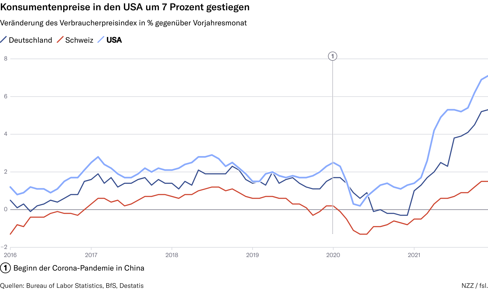
  </figure>
  

    
SBERT: 0.68

    
LLM-Judge (1–5):

    <ul>
      <li>Klarheit: 4</li>
      <li>Vollständigkeit: 4</li>
      <li>Kürze: 2</li>
      <li>Gefühlte Vollständigkeit: 5</li>
      <li>Neutralität: 3</li>
      <li>Korrektheit: 2</li>
    </ul>
  

**Gold-Standard (Overview):**

> *Die Konsumentenpreise steigen zwischen 2016 und 2018 leicht an und sinken danach wieder bis 2021. Ab 2021 steigen die Konsumpreise stark an.*

**LLM-generiert (Overview):**

> *Über den gesamten Zeitraum liegt die Inflation in den USA am höchsten, gefolgt von Deutschland. Die Schweiz weist die geringste Inflationsrate auf, die zudem bis 2020 oft negativ ist. Ab 2020 steigen die Inflationsraten in allen drei Ländern deutlich, wobei die USA den stärksten Anstieg verzeichnen und Ende 2021 die höchste Rate aufweisen.*

**Einschätzung:** Bei diesem komplexen Chart zeigen sich gleich mehrere typische LLM-Probleme auf einmal. Der Overview liefert drei Sätze, wo einer genügen würde — und nimmt bereits inhaltlich vorweg, was in die lange Beschreibung gehörte. In der langen Beschreibung wiederum fehlt die zeitliche Struktur des Gold-Standards, der klar in Phasen gliedert (2016-2018 leichter Anstieg, dann Rückgang bis 2021, dann starker Anstieg). Stattdessen wird der Anstieg ab 2021 mit «drastisch» beschrieben — ein wertendes Wort, das unsere Stilregeln explizit ausschliessen. Ausserdem fehlt die Erwähnung des Events «Beginn der Corona-Pandemie», obwohl es als vertikale Markierung im Chart steht. Der Neutralitäts-Score von 3/5 greift genau diese Problematik auf.

---

Diese vier Beispiele machen sichtbar, was keine einzelne Metrik allein erfassen kann. SBERT kann strukturelle Distanz mit inhaltlicher Schwäche verwechseln (Beispiel 3) — oder umgekehrt bei hoher semantischer Nähe stilistische Mängel wie Verbosität unterschlagen (Beispiel 1). Für den produktiven Einsatz ist deshalb weniger die automatische Bewertung entscheidend, als das, was die Interviews und die qualitativen Analysen zeigen: Stilregeln zu Rundung, Neutralität und Metadaten-Vollständigkeit lassen sich direkt in den Prompt einbauen — und heben die Qualität deutlich.

## Take-away: Hybrid statt Hype

Der vielleicht wichtigste Befund unseres Projekts ist auch der unspektakulärste: Reines LLM-Prompting für Alt-Texte ist verlockend, aber suboptimal. Was wirklich funktioniert, ist ein hybrider Ansatz — deterministische Templates für die Metadaten, LLMs für die interpretativen Teile. Diese Trennung ist nicht nur technisch sauberer, sie ist auch praktisch effizienter: Templates kosten kein API-Budget, sind reproduzierbar und produzieren keine Halluzinationen. LLMs werden gezielt dort eingesetzt, wo ihre Stärke liegt.

Für die Praxis bedeutet das: Eine Redaktion wie die NZZ könnte morgen anfangen, Charts zugänglich zu machen — ohne darauf zu warten, dass LLMs irgendwann perfekt sind. Die Metadaten-Templates lassen sich aus den vorhandenen Chart-Definitionen direkt ableiten. Die LLM-Generierung lässt sich auf Überblick und lange Beschreibung beschränken, mit klaren Stilregeln und chartspezifischen Beispielen.

Was offen bleibt: Mehr Chart-Typen müssten abgedeckt werden — Karten, Streudiagramme, Sankey-Diagramme. Die Stichprobe der interviewten Personen sollte deutlich grösser werden, um die Bandbreite an Präferenzen abzubilden. Modellvergleiche zwischen verschiedenen LLMs könnten zeigen, ob Open-Source-Alternativen mit kommerziellen Modellen mithalten. Und schliesslich: Generierungsparameter jenseits der Temperature, etwa Top-K oder Top-P, wurden in unserem Projekt nicht systematisch untersucht.

Die EAA verlangt seit Juni 2025 zugängliche Charts. Vielleicht hört der Screen Reader bei der nächsten NZZ-Lektüre nicht mehr auf, sobald ein Chart kommt — sondern fängt an zu erzählen.

## Quellen

- Accessibility Guidelines Working Group (o. J.). *Technique G95: Providing short text alternatives that provide a brief description of the non-text content.* W3C. [w3.org/WAI/WCAG22/Techniques/general/G95](https://www.w3.org/WAI/WCAG22/Techniques/general/G95.html)

- Belle, A. et al. (2022). *Alt-texify: A pipeline to generate alt-text from SVG visualizations.* ENASE. [doi.org/10.5220/0010994600003176](https://doi.org/10.5220/0010994600003176)

- European Union (2019). *Directive (EU) 2019/882 on the accessibility requirements for products and services.* [eur-lex.europa.eu](https://eur-lex.europa.eu/eli/dir/2019/882/oj/eng)

- Jung, C. et al. (2022). *Communicating visualizations without visuals: Investigation of visualization alternative text for people with visual impairments.* IEEE TVCG, 28(1), 1095–1105. [doi.org/10.1109/TVCG.2021.3114846](https://doi.org/10.1109/TVCG.2021.3114846)

- Reimers, N. & Gurevych, I. (2019). *Sentence-BERT: Sentence embeddings using Siamese BERT-networks.* [arxiv.org/abs/1908.10084](https://arxiv.org/abs/1908.10084)

- Schweizerischer Blinden- und Sehbehindertenverband (SBV). *E-Kiosk.* [sbv-fsa.ch](https://sbv-fsa.ch/publikationen-und-apps/apps/e-kiosk/)

- Spring, S. (2019). *Sehbehinderung, Blindheit und Hörsehbehinderung: Entwicklung in der Schweiz — Berechnungen 2019.* SZBLIND. [szblind.ch](https://www.szblind.ch/fileadmin/pdfs/Forschung/Forschungsberichte/SZBLIND_-_Sehbehinderung_..._Entwicklung_in_der_Schweiz_-_Berechnungen_2019_bf.pdf)

## Über das Projekt

Dieser Beitrag basiert auf dem Challenge-X-Projekt *Improving Accessibility of Charts through LLM-Generated Alt Texts*, durchgeführt im Herbstsemester 2025 an der Hochschule für Informatik FHNW.

**Team:** Julia Locher und Alessia Vannini

**Betreuung:** Arzu Çöltekin, Marianne Santaholma und Claudia Amsler (FHNW)

**Praxispartner:** Jonas Oesch (Neue Zürcher Zeitung) und Luciano Butera (Schweizerischer Blinden- und Sehbehindertenverband SBV)

**Repository:** [github.com/a-vannini/AltText4Charts](https://github.com/a-vannini/AltText4Charts)

  
  
  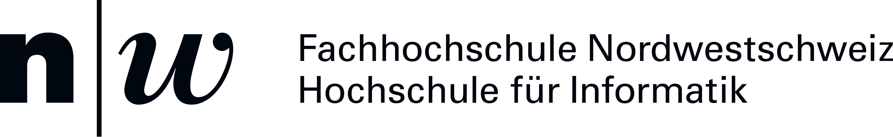

