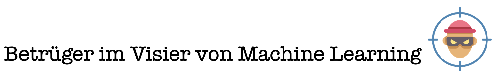

Dieser Blogbeitrag zeigt, wie man Geldwäscheversuche mit Machine Learning erkennt. Wir präsentieren im Detail verschiedene Ansätze und teilen unsere Erfahrungen. Der Schwerpunkt liegt darauf, die Entwicklung von klassischen Machine-Learning-Algorithmen bis hin zu innovativen Graph Neural Networks zu erklären. Mit der Länge des Artikels wächst die Komplexität. Der Beitrag richtet sich an Leser, die ein Faible für Daten oder Statistik haben und mit dem Begriff "Modell" vertraut sind.

Laut den Vereinten Nationen werden jährlich 2 bis 5% des globalen BIP – etwa 800 Milliarden bis 2 Billionen US-Dollar – durch Geldwäsche verschleiert. Ein wiederkehrendes Problem in der Geldwäsche-Forschung ist die Verfügbarkeit realer Datensätze. Das AMLworld-Framework bietet hier eine Lösung, indem es synthetische Finanztransaktionen generiert, die reale Szenarien mit hoher Präzision nachbilden, einschliesslich bekannter Geldwäschemuster. Diese vollständig gelabelten Daten ermöglichen eine objektive Bewertung von Algorithmen (Altman et al., 2024). Grundlage des AMLworld-Frameworks ist der synthetische Datensatz [IBM Transactions for Anti Money Laundering (AML)](https://www.kaggle.com/datasets/ealtman2019/ibm-transactions-for-anti-money-laundering-aml), mit dem auch wir in unserem Projekt arbeiteten und den wir im nächsten Kapitel vorstellen. 

# Die Daten
Der Datensatz umfasst 5'073'168 Transaktionen und 11 Variablen. Er beschreibt Transaktionen zwischen Banken und Konten, einschliesslich Zeitstempeln, Beträgen, Währungen, Zahlungsformaten und Labels, die Transaktionen als legal oder Geldwäsche kennzeichnen. 
Die Transaktionen erstrecken sich über 17 Tage ab dem 1. September 2022. Die meisten Daten stammen aus den ersten 10 Tagen, während die restlichen Tage weniger Aktivität zeigen. Auffällig ist das starke Ungleichgewicht: 99,9% der Transaktionen sind legal, nur 0,1% (5177) gelten als Geldwäsche. 
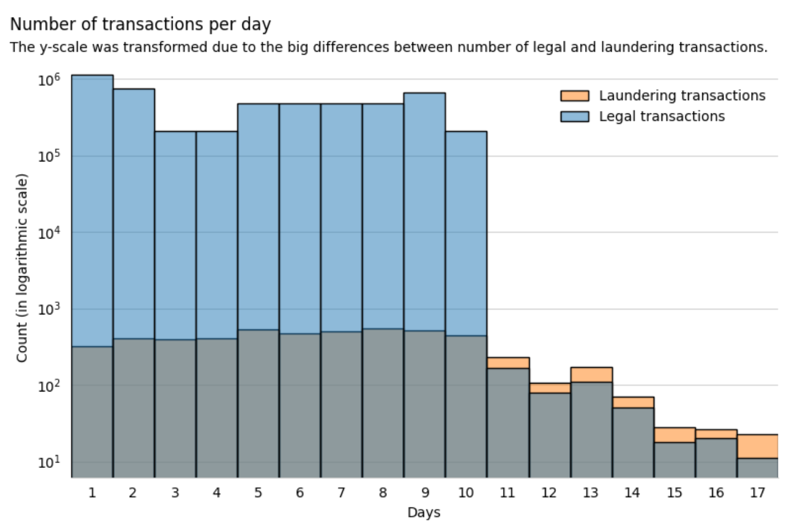

Der Datensatz umfasst 30'470 Banken und 515'080 Konten. Eine kleine Anzahl von Banken und Konten wickelt den Grossteil der Transaktionen ab: Die 10 aktivsten Banken verantworten 18,1% aller Transaktionen. Bei den Konten gibt es zentrale Akteure, von denen einige über 100'000 Transaktionen ausführen, während viele andere nur ein- oder zweimal aktiv sind. 
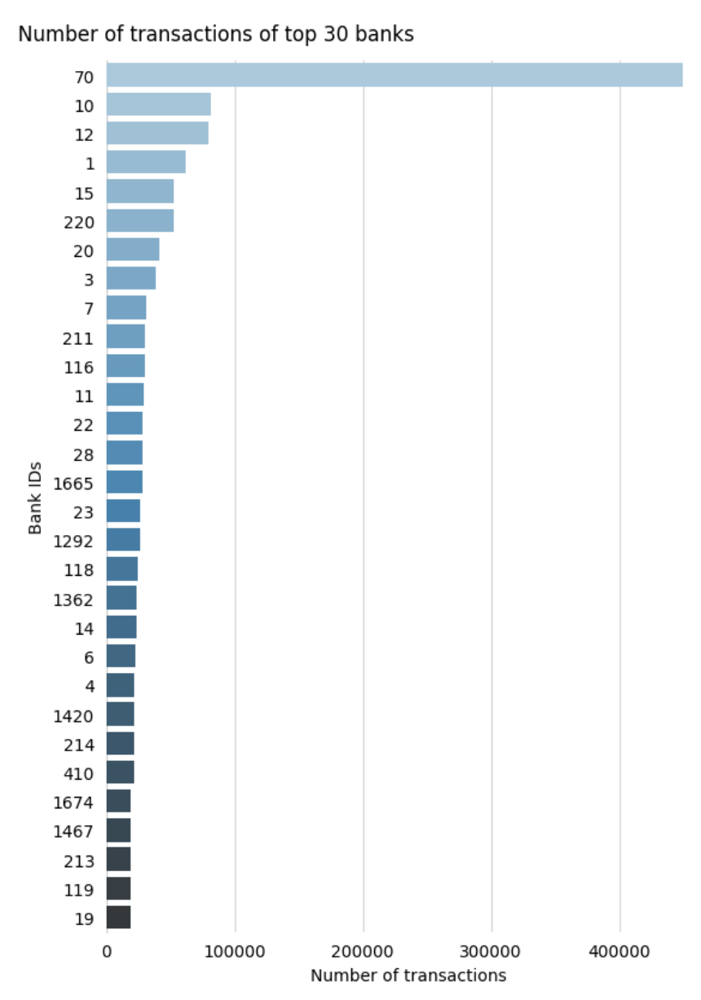

Die Transaktionsbeträge, sowohl ein- als auch ausgehend, variieren stark. Meistens handelt es sich um kleine Beträge, doch einige extrem hohe Summen (bis zu 1 Billion USD) verzerren den Durchschnitt. Zur besseren Analyse wurden die Beträge in US-Dollar umgerechnet. 
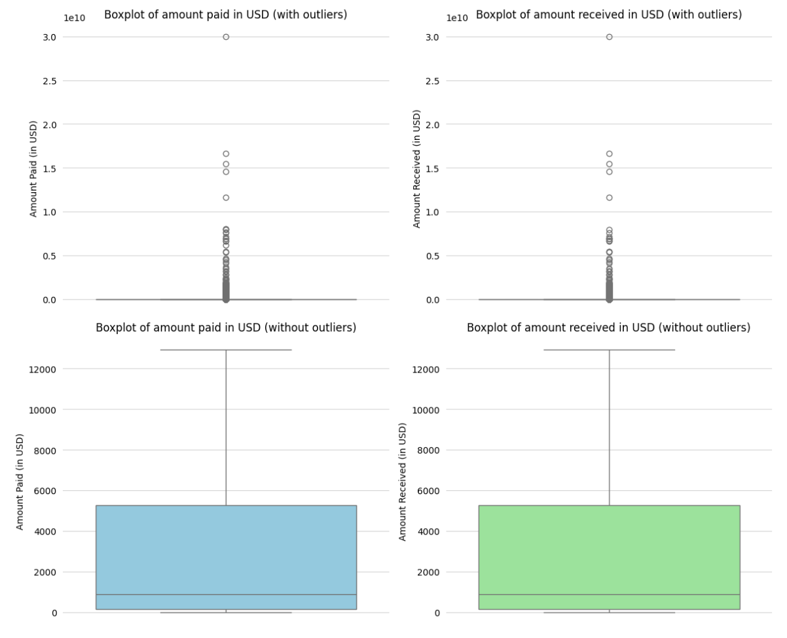

US-Dollar und Euro dominieren die Transaktionen, während Währungen wie Bitcoin oder Saudi Riyal selten vorkommen. Interessant ist, dass 98.6% der Transaktionen in derselben Währung erfolgen, nur 1.4 % beinhalten Währungsumrechnungen. 
Der Datensatz unterscheidet sieben Zahlungsmethoden, darunter Schecks, Kreditkarten, ACH (Automated Clearing House), Bargeld und Bitcoin. Schecks dominieren, während Bitcoin, trotz seiner zunehmenden Nutzung in der Geldwäsche, selten vorkommt.  
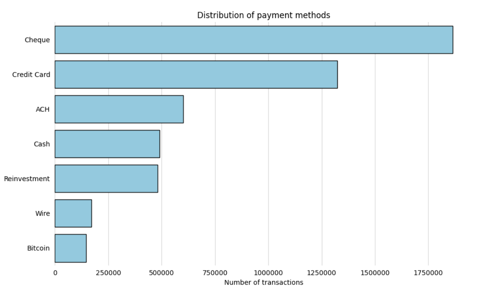

Ein auffälliges Merkmal von Geldwäsche ist der hohe Betrag der Transaktionen, die oft am oberen Ende der Skala liegen. Während legale Transaktionen meist kleinere Summen umfassen, bewegen sich illegale häufiger in höheren Bereichen. Dies zeigt, dass grosse Geldbeträge in wenigen Schritten verschoben werden, um die Herkunft zu verschleiern.
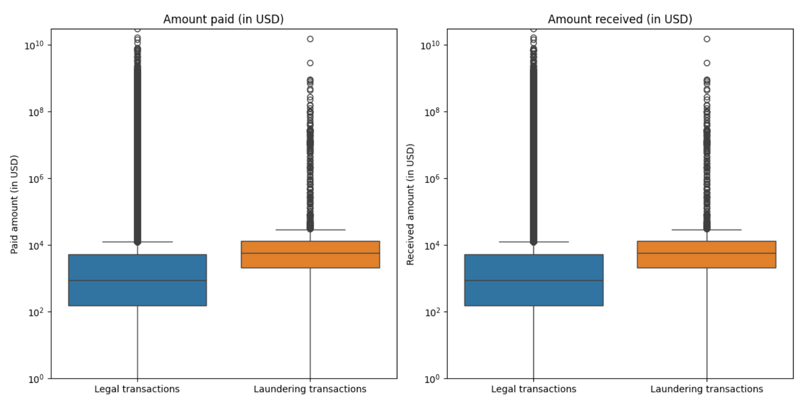

Auch die Aktivität einzelner Konten liefert Hinweise auf Geldwäsche. Einige Konten im Datensatz zeigen eine überdurchschnittlich hohe Anzahl an ausgehenden Transaktionen. Solche Konten könnten als "Mule Accounts" fungieren, also Zwischenstationen, über die illegale Gelder fliessen. Die Analyse zeigt, dass diese Konten oft zentrale Knotenpunkte in Transaktionsnetzwerken bilden und deshalb besonders auffallen.
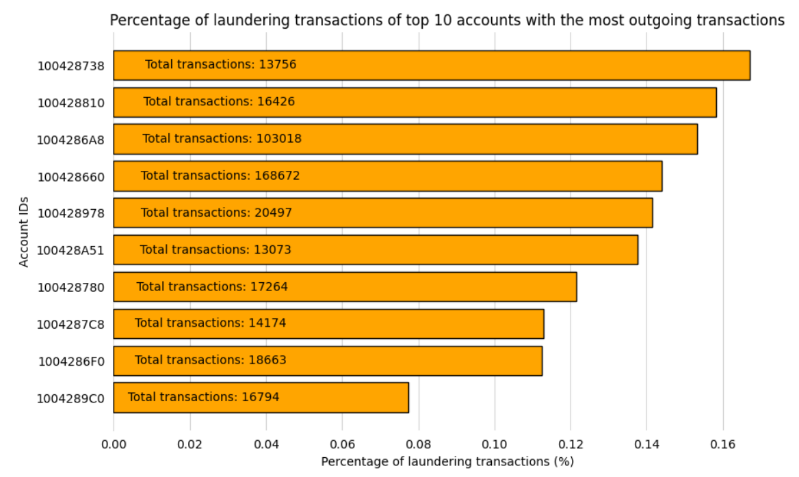

Ein weiteres typisches Muster ist die elektronische Überweisung per ACH. Diese geht oft auf Konten bei anderen Banken. Dabei fällt der Saudi-Riyal besonders auf, neben den häufig genutzten Währungen wie US-Dollar und Euro, unabhängig davon, ob die Transaktion legitim oder betrügerisch ist. 

    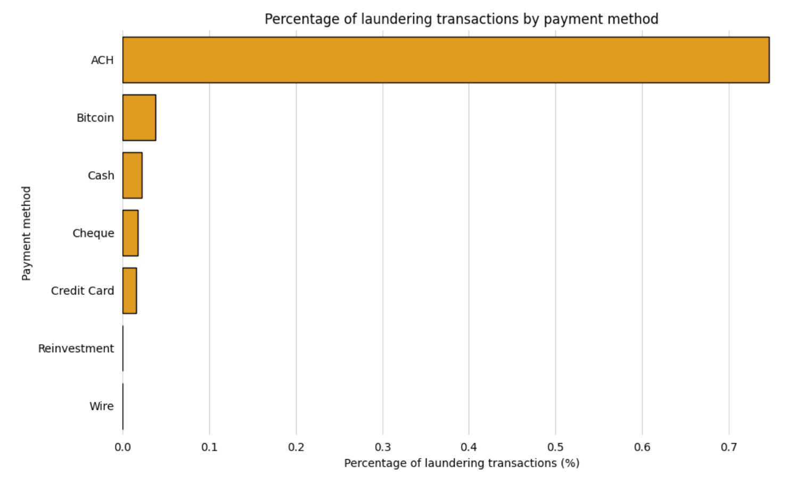
    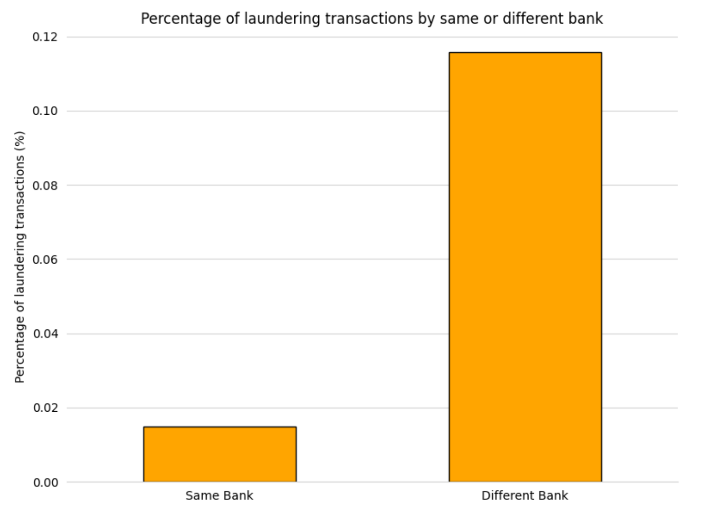
    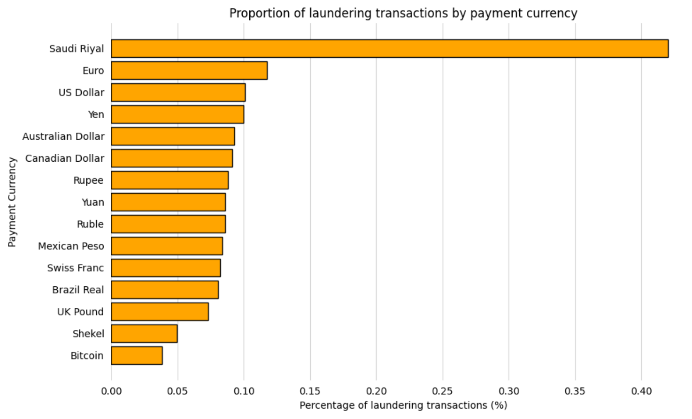

Im Kampf gegen Geldwäsche ist es auch entscheidend, typische Muster in Transaktionen zu erkennen, die illegale Aktivitäten verraten. Solche Muster beschreiben spezifische Verhaltensweisen, die darauf abzielen, die Herkunft illegaler Gelder zu verschleiern und sie als legitim erscheinen zu lassen. Im Datensatz sind diese Muster häufig gekennzeichnet, sodass die meisten Transaktion einem bestimmten Muster zugeordnet werden können. Diese Kennzeichnung basiert auf bekannten Geldwäschemechanismen und umfasst Cycles, Scatter-Gather-Strukturen, Chains und andere komplexe Netzwerke. Nachfolgend stellen wir zwei der prominentesten Geldwäsche-Muster aus dem Datensatz vor: Simple Cycles und Scatter-Gather-Strukturen.  

## Simple Cycles 
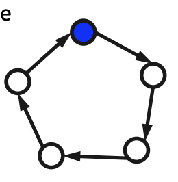
Das Simple Cycles-Muster beschreibt eine geschlossene Kette von Transaktionen, bei der Gelder innerhalb eines festen Kontenkreises zirkulieren. Diese Strategie zielt darauf ab, die ursprüngliche Herkunft der Gelder durch mehrfache Überweisungen zu verschleiern. 

Beispiel: 
- Konto A überweist Geld an Konto B.  
- Konto B überweist einen Teil oder den gesamten Betrag an Konto C.  
- Konto C überweist schliesslich das Geld zurück an Konto A.  

Dieses Verhalten zeigt sich oft in der Layering-Phase der Geldwäsche, wenn man Gelder durch verschiedene Konten schleust, um die Spur zu verwischen. Simple Cycles wirken zunächst legitim, doch ihre wiederholte Struktur und der fehlende wirtschaftliche Zweck entlarven sie. In den zuvor vorgestellten Modellen gelten sie als besonders schwer erkennbar, vor allem bei mehr als sechs beteiligten Konten. 

## Scatter-Gather-Strukturen 
Ein weiteres verbreitetes Muster ist die Scatter-Gather-Struktur, die oft in der Integrationsphase der Geldwäsche verwendet wird. Dieses Verhalten besteht aus zwei klar unterscheidbaren Teilen:  

**Scatter:** Gelder werden von einem zentralen Konto auf mehrere Empfängerkonten verteilt.
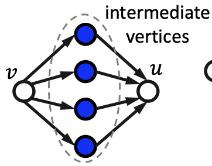

**Gather:** Die Gelder fliessen anschliessend von diesen Empfängerkonten zurück auf ein oder mehrere zentrale Konten.
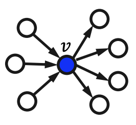

Beispiel: 
- Konto A überweist Gelder an die Konten B, C und D (Scatter).  
- Konten B, C und D leiten diese Gelder zurück an Konto E (Gather).  

Diese Struktur verschleiert die Geldspur durch Streuung und spätere Zusammenführung. Scatter-Gather-Muster sind oft hochgradig organisiert und schwer zu erkennen, da ähnliche Verhaltensweisen auch in legitimen Transaktionsnetzen vorkommen können.  

# Herausforderung und Evaluierung von Modellen 
Zunächst müssen wir verstehen, welche Herausforderungen Machine-Learning-Modelle bewältigen und wie wir ihre Leistung messen. In der Welt des maschinellen Lernens begegnen wir oft Datensätzen mit unausgewogener Klassenverteilung. Das bedeutet, eine Klasse – etwa betrügerische Transaktionen – tritt deutlich seltener auf als die andere, wie legitime Transaktionen. Diese seltene Klasse heisst Minority-Class (Minderheitsklasse).
Die Herausforderung bei der Arbeit mit solchen Daten besteht darin, dass herkömmliche Metriken wie die Genauigkeit (Accuracy) oft in die Irre führen. Ein Modell könnte etwa 99% Genauigkeit erzielen, indem es stets die Mehrheitsklasse (legitime Transaktionen) vorhersagt, dabei jedoch keine betrügerischen Transaktionen erkennt. Hier greift der Minority-Class F1-Score ein. Der F1-Score balanciert Präzision und Recall aus. Diese beiden Masse sind entscheidend, um die Leistung eines Modells bei der Erkennung der Minderheitsklasse zu bewerten.

**Präzision** gibt an, wie viele der als betrügerisch eingestuften Transaktionen tatsächlich betrügerisch sind. 

$$
\text{Präzision} = \frac{\text{True Positives (TP)}}{\text{True Positives (TP)} + \text{False Positives (FP)}}
$$

**Recall** zeigt, wie viele der tatsächlich betrügerischen Transaktionen das Modell erkennt. 

$$
\text{Recall} = \frac{\text{True Positives (TP)}}{\text{True Positives (TP)} + \text{False Negatives (FN)}}
$$

Der **F1-Score**, das harmonische Mittel dieser beiden Werte, berechnet sich so: 

$$
\text{F1} = 2 \cdot \frac{\text{Präzision} \cdot \text{Recall}}{\text{Präzision} + \text{Recall}}
$$  

Ein hoher F1-Score für die Minderheitsklasse zeigt, dass das Modell sowohl präzise als auch sensibel seltene Klassen erkennt und so eine faire, aussagekräftige Bewertung bei unausgewogenen Daten ermöglicht. 

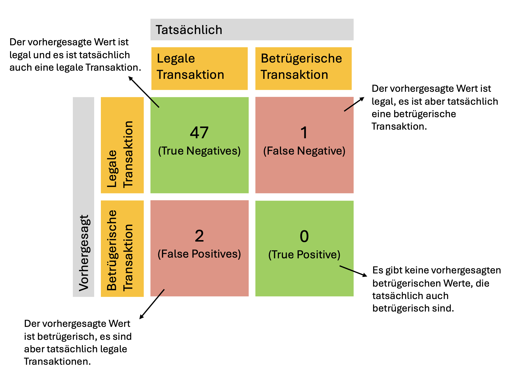

> Ein Beispiel: Stellen wir uns einen Datensatz mit 50 Transaktionen vor, von denen 2% betrügerisch sind. Eine
> Transaktion ist betrügerisch (True Positive, wenn korrekt erkannt). Das Modell markiert jedoch fälschlicherweise zwei 
> weitere Transaktionen als betrügerisch (False Positives) und übersieht die betrügerische Transaktion (False Negative).

Die Berechnungen lauten: 

**Präzision:** Wie viele der als betrügerisch klassifizierten Transaktionen sind tatsächlich betrügerisch?

$$
\text{Präzision} = \frac{\text{True Positives (TP)}}{\text{True Positives (TP)} + \text{False Positives (FP)}} = \frac{0}{0 + 2} = 0{,}0 \, (0\%)
$$

**Recall:** Wie viele der tatsächlich betrügerischen Transaktionen hat das Modell erkannt?

$$
\text{Recall} = \frac{\text{True Positives (TP)}}{\text{True Positives (TP)} + \text{False Negatives (FN)}} = \frac{0}{0 + 1} = 0{,}0 \, (0\%)
$$

**F1-Score:** Der F1-Score ist undefiniert, da sowohl Präzision als auch Recall 0 sind. Das zeigt, dass das Modell die betrügerische Transaktion nicht erkannt hat.  

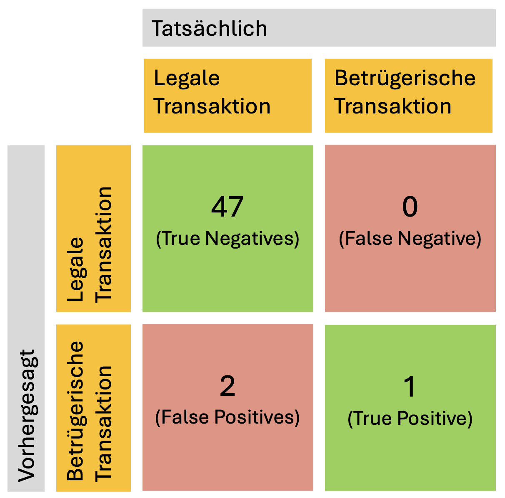

> Stellen wir uns vor, das Modell erkennt die betrügerische Transaktion korrekt erkennt und zwei weitere Transaktionen
> fälschlicherweise als betrügerisch.

Dann lauten die Werte:  

$$
\text{Präzision} = \frac{1}{1 + 2} = 0{,}33 \, (33\%)
$$

$$
\text{Recall} = \frac{1}{1 + 0} = 1{,}0 \, (100\%)
$$

$$
\text{F1} = 2 \cdot \frac{\text{Präzision} \cdot \text{Recall}}{\text{Präzision} + \text{Recall}} = 2 \cdot \frac{0{,}33 \cdot 1{,}0}{0{,}33 + 1{,}0} \approx 0{,}5 \, (50\%)
$$
 
Der F1-Score zeigt eine moderate Balance zwischen Präzision und Recall. Das Modell erkennt die betrügerische Transaktion, jedoch mit einigen Fehlalarmen. Dieses Beispiel verdeutlicht, wie der F1-Score die Modellleistung bei stark unausgewogenen Daten misst. 

Das folgende Kapitel beschreibt Methoden, die unsere Arbeit inspirierten.  

# Vorstellung Modellansätze aus Papers 
Liu et al. (2020) konzentrierten sich auf die Verbesserung von Graph Neural Networks (GNNs), die vielversprechend für die Analyse relationaler Daten sind. Sie entwickelten das Framework **GraphConsis**, um Inkonsistenzen in Graphdaten zu beheben. Solche Inkonsistenzen entstehen, wenn Betrüger ihre Verbindungen tarnen, indem sie scheinbar normale Netzwerke aufbauen. GraphConsis filtert diese Störungen und identifiziert konsistente Nachbarschaftsstrukturen, was die Erkennungsleistung in realen Datensätzen signifikant verbessert.  
 
Ein weiterer Ansatz ist der **Graph Feature Preprocessor (GFP)**, der speziell für die Echtzeit-Erkennung von Geldwäschemustern wie Simple Cycles oder Scatter-Gather entwickelt wurde. Dieses Tool extrahiert Merkmale aus Finanztransaktionsgrafen und erweitert traditionelle Machine-Learning-Modelle wie Gradient Boosted Trees. Die Kombination dieser Modelle mit Graph-Features steigerte die F1-Score für die Erkennung von Minderheitsklassen um bis zu 36%, was die Bedeutung von Graph-basierten Features für die Betrugserkennung unterstreicht (Blanuša et al., 2024).  

Egressy et al. leisteten einen innovativen Beitrag, indem sie gerichtete Multigraphen in den Fokus rückten. Sie passten GNNs für diese komplexen Strukturen an und erkannten durch Techniken wie **Reverse Message Passing** und **Port-Nummerierung** effizient Muster wie Zyklen und Scatter-Gather. Dieser Ansatz verbesserte die Erkennungsrate von Geldwäsche-Transaktionen um bis zu 30%. Parallel dazu setzte die Forschung zu Ensemble-Modellen neue Massstäbe.

Vashistha et al. entwickelten das **Hyper Ensemble Machine Learning (HEML)**, das Modelle wie Neuronale Netze, Entscheidungsbäume und Isolation Forests kombiniert. HEML zeigte aussergewöhnliche Robustheit bei der Erkennung unbekannter Betrugsmuster und reduzierte die Rate falscher Alarme erheblich. Dieser Ansatz gleicht die Schwächen einzelner Modelle durch die Kombination verschiedener Algorithmen aus. 

# Unsere Modelle 
In unserem Projekt verfolgen wir zwei Ansätze, um Geldwäsche in einem unausgewogenen Datensatz aufzuspüren: nicht graph-basierte und graph-basierte Modelle. 

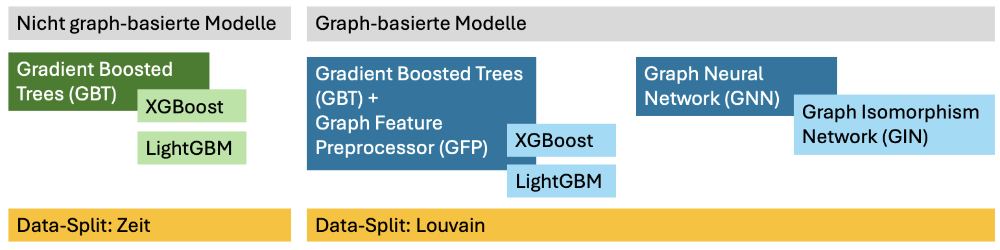

## Nicht graph-basiert
Nicht graph-basierte Modelle analysieren Transaktionen isoliert. Sie ignorieren die Beziehungen zwischen Sender- und Empfängerkonten und konzentrieren sich stattdessen auf Transaktionsmerkmale wie Betrag, Währung oder Zahlungsformat. Diese Methode eignet sich, wenn die Datenstruktur keine klaren Verbindungen zeigt oder eine schnelle, skalierbare Analyse nötig ist. Sie versagt jedoch bei der Erkennung komplexer Netzwerke oder Abhängigkeiten. In unserem Fall erwarten wir deshalb eine schlechte Modellleistung. 

Für den nicht graph-basierten Ansatz nutzen wir Gradient Boosted Trees (GBT). Diese Methode kombiniert viele einfache Entscheidungsbäume, um Vorhersagen zu verbessern. Entscheidungsbäume teilen Daten durch Ja/Nein-Fragen in Kategorien. 

> Ein Beispiel: Wir wollen prüfen, ob eine Transaktion betrügerisch ist. Die Daten: 
> - Betrag: 15'000 USD 
> - Währung: Bitcoin 
> - Zahlungsformat: Kreditkarte 
> - Sender: Konto mit auffälligem Transaktionsmuster 

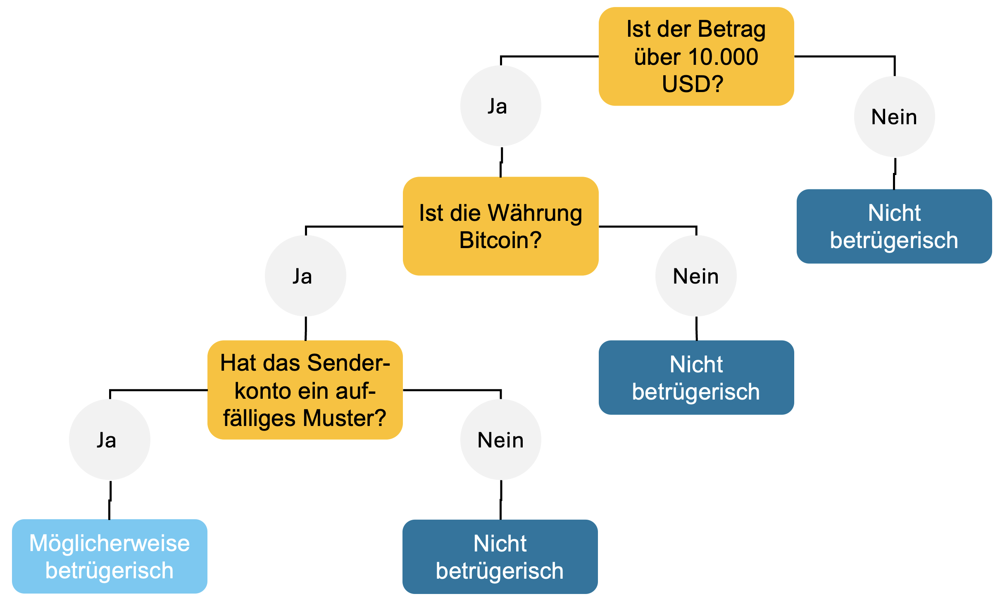

Ein einzelner Entscheidungsbaum könnte dabei so aussehen. Dieser Baum liefert eine erste Einschätzung. GBT erstellt viele solcher Bäume und verbessert sie schrittweise, indem es sich auf die Fehler der vorherigen Bäume konzentriert. Erkennt der erste Baum einige betrügerische Transaktionen nicht, trainiert der nächste Baum gezielt darauf.

### Data-Split 
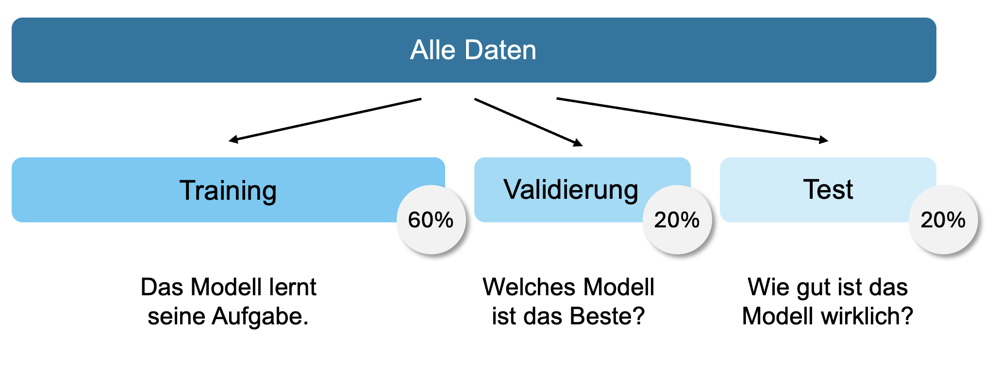

Um maschinelle Lernmodelle zu entwickeln, teilen wir den Datensatz in Trainings-, Validierungs- und Testdaten auf. Dieser Schritt ist entscheidend, damit das Modell nicht nur effektiv lernt, sondern auch auf unbekannte Daten verallgemeinert und seine Leistung präzise bewertet wird. Altman et al. (2024) schlagen eine Aufteilung von 60/20/20 vor: 
- 60% Trainingsdaten: Das Modell erkennt Muster in diesen Daten.  
- 20% Validierungsdaten: Diese optimieren das Modell, etwa durch Justieren von Hyperparametern. 
- 20% Testdaten: Sie prüfen, wie gut das Modell in einem unabhängigen Szenario tatsächlich abschneidet. 

In unserem Projekt folgen wir dieser Empfehlung. Der IBM-AML-Datensatz umfasst Transaktionen über 17 Tage. Wir wendeten den Split jedoch nur auf die ersten 10 Tage an. Diese Entscheidung stützt sich auf Erkenntnisse aus der [Kaggle Diskussion)](https://www.kaggle.com/datasets/ealtman2019/ibm-transactions-for-anti-money-laundering-aml/discussion/427517). Dort wird betont, dass die letzten 7 Tage des Datensatzes gezielt für Szenarien mit mehr Geldwäsche-Transaktionen synthetisch erstellt wurden. Diese künstliche Verzerrung könnte die Modellleistung unrealistisch beeinflussen, da es auf überrepräsentierte Daten abgestimmt würde, die in der Realität selten sind. Neben der zeitlichen Aufteilung untersuchen wir auch die Verteilung der Geldwäsche-Muster im Datensatz. Unser Ziel ist, sicherzustellen, dass die Muster im Training, in der Validierung und im Test ähnlich verteilt sind, damit das Modell keine Muster "überlernt". 

### Die Modelle detailliert
Wir implementieren zwei Varianten von Gradient Boost Modellen:  
- XGBoost (Extreme Gradient Boosting) 
- LightGBM (Light Gradient Boosting Machine) 

#### XGBoost

XGBoost erweitert das Gradient Boosting durch mehrere Optimierungen. Diese Open-Source-Bibliothek besticht durch hohe Geschwindigkeit und Flexibilität. Der Algorithmus kombiniert Entscheidungsbäume, wobei jeder Baum die Fehler des vorherigen korrigiert. XGBoost zeichnet sich besonders dadurch aus, dass es gezielt unausgewogene Datensätze wie unseren Geldwäsche-Datensatz bearbeitet. Es nutzt gewichtetes Training, um die Erkennung seltener Klassen, etwa betrügerischer Transaktionen, zu verbessern. Bei einem Anteil von 0.1% Geldwäsche-Transaktionen könnte ein Modell ohne Anpassungen alle Transaktionen als "legitim" einstufen und dennoch hohe Genauigkeit erreichen. Um dies zu verhindern, ermöglicht XGBoost, der Verlustfunktion einen Gewichtungsfaktor hinzuzufügen. Dieser Faktor verleiht den seltenen Klassen mehr Gewicht, sodass das Modell sie präziser klassifiziert. 

> Wieder unser Beispiel: Betrachten wir die 50 Transaktionen, von denen 2%, also eine, betrügerisch ist. Ohne 
> Klassengewichtung könnte das Modell alle Transaktionen als "legitim" einstufen und dennoch 98% Genauigkeit erreichen. Das
> wäre nutzlos, da keine betrügerische Transaktion erkannt würde. Um dies zu verhindern, geben wir der Klasse "betrügerisch"
> eine höhere Gewichtung, etwa den Faktor 49, basierend auf dem Verhältnis von legitimen zu betrügerischen Transaktionen. So
> wird der Fehler, eine betrügerische Transaktion zu übersehen, 49-mal stärker bestraft als der Fehler, eine legitime 
> Transaktion fälschlich als betrügerisch zu klassifizieren.

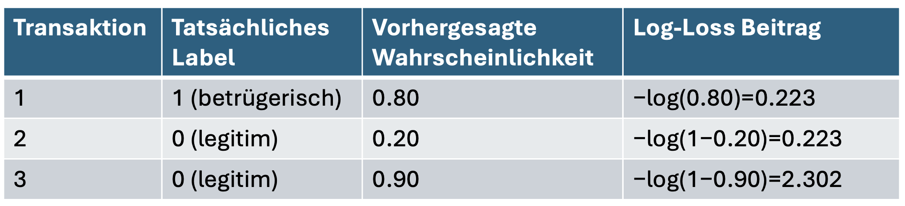
XGBoost nutzt zudem spezielle Optimierungen für Klassifikationsprobleme, wie Log-Loss. Diese Funktion misst, wie gut die vorhergesagte Wahrscheinlichkeit mit der tatsächlichen Klasse übereinstimmt. Bei einer betrügerischen Transaktion soll das Modell eine Wahrscheinlichkeit nahe 1 liefern, bei legitimen nahe 0. Weicht die Vorhersage stark von der tatsächlichen Klasse ab, bestraft die Funktion das Modell stärker. So trifft das Modell nicht nur Entscheidungen, sondern liefert auch zuverlässige Wahrscheinlichkeiten. 

- Das Modell schätzte die erste Transaktion (betrügerisch) mit einer hohen Wahrscheinlichkeit von 0.80 ein. Diese liegt nahe an der tatsächlichen Klasse, daher bleibt der Log-Loss-Beitrag gering (0.223).  
- Bei der zweiten Transaktion (legitim) sagte das Modell korrekt eine niedrige Wahrscheinlichkeit von 0.20 voraus, was ebenfalls zu einem kleinen Log-Loss-Beitrag führt.  
- Bei der dritten Transaktion (legitim) prognostizierte das Modell jedoch fälschlicherweise eine hohe Wahrscheinlichkeit von 0.90 für "betrügerisch". Dieser Fehler wird stark bestraft (2302).  
Der Gesamt-Log-Loss ergibt sich aus dem Durchschnitt der einzelnen Beiträge. 

#### LightGBM

LightGBM wurde entwickelt von Microsoft. Seine Effektivität beruht auf der innovativen Methode des Leaf-Wise Tree Growth beim Aufbau von Entscheidungsbäumen. Herkömmliche Algorithmen erweitern Bäume symmetrisch und levelweise, indem sie alle Knoten gleichzeitig ausbauen.
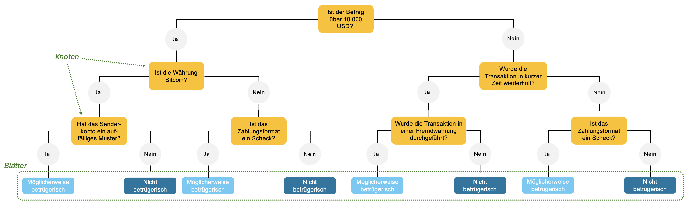

LightGBM hingegen wächst blattweise und fügt Verzweigungen dort hinzu, wo sie den grössten Informationsgewinn bieten. So entstehen oft asymmetrische Bäume.
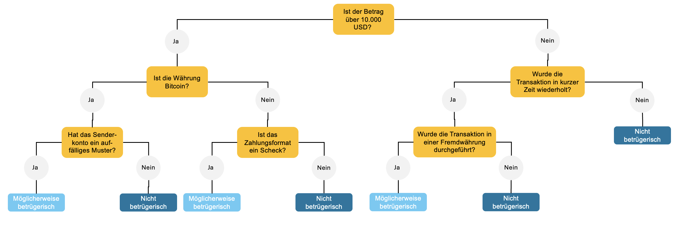

LightGBM passt zudem automatisch die Gewichtung der Klassen an, indem es den Anteil der Minderheitsklasse berücksichtigt. Ist diese Option aktiviert, erhöht der Algorithmus das Gewicht der seltenen Klasse, etwa bei betrügerischen Transaktionen, sodass sie im Training mehr Einfluss auf die Verlustfunktion hat. Beim Beispiel mit 50 Transaktionen, von denen 49 legitim und 1 betrügerisch sind, weist LightGBM der betrügerischen Klasse automatisch ein höheres Gewicht zu, etwa im Verhältnis 49:1. Zusätzlich erlaubt LightGBM, die Gewichtung der positiven Klasse manuell zu definieren. Unter anderem dank des Leaf-Wise Tree Growth arbeitet der Algorithmus speicher- und zeitoptimierter als XGBoost. 

### Sampling
Um das Problem unausgewogener Klassenverteilung zu lösen, setzen wir verschiedene Sampling-Methoden ein: 

Beim **Undersampling** reduzieren wir die Grösse der Mehrheitsklasse, indem wir zufällig eine Teilmenge auswählen. So gleichen wir den Datensatz aus. Im Beispiel mit 49 legitimen und 1 betrügerischen Transaktion würde das bedeuten, dass wir nach dem Undersampling je 1 legitime und 1 betrügerische Transaktion haben. Dabei entfernen wir viele Datenpunkte, was das Risiko birgt, wichtige Informationen der Mehrheitsklasse zu verlieren. 

Beim **Oversampling** wird die Minderheitsklasse künstlich vergrössert, indem bestehende Datenpunkte dupliziert werden. Dadurch bleibt die Grösse der Mehrheitsklasse erhalten, während die Minderheitsklasse vergrössert wird. In unserem Beispiel würde die eine Transaktion dupliziert, bis es 49 betrügerische Transaktionen gäbe. Da dieselben Datenpunkte dadurch mehrmals verwendet werden, besteht die Gefahrt von Overfitting. 

**SMOTE** ist eine fortschrittliche Oversampling-Methode, die synthetische Datenpunkte für die Minderheitsklasse erzeugt, statt bestehende zu kopieren. Sie berechnet Zwischenwerte zwischen vorhandenen Datenpunkten der Minderheitsklasse, um neue zu schaffen. Bei zwei betrügerischen Transaktionen von 10'000 USD und 20'000 USD erzeugt SMOTE eine neue Transaktion mit einem Betrag zwischen diesen Werten, etwa 17'000 USD. 

**ADASYN** erweitert SMOTE, indem es sich auf schwer klassifizierbare Datenpunkte konzentriert. Während SMOTE Datenpunkte gleichmässig erzeugt, generiert ADASYN mehr synthetische Punkte dort, wo die Minderheitsklasse schwächer vertreten ist. ADASYN bewertet die Schwierigkeit, jeden Punkt der Minderheitsklasse korrekt zu klassifizieren. Bei zwei betrügerischen Transaktionen – eine mit seltenem und eine mit üblichem Währungsformat – erstellt ADASYN mehr synthetische Transaktionen für die seltene Währung, da diese schwerer zu klassifizieren ist. 

## Graph-basierte Modelle
Graph-basierte Modelle erfassen im Gegensatz zu nicht graph-basierten Ansätzen die Beziehungen zwischen den Akteuren (Knoten) im Netzwerk. Jede Transaktion erscheint als Verbindung (Kante) zwischen zwei Akteuren, was ein vollständiges Transaktionsnetzwerk schafft. Dieser Ansatz eignet sich besonders, um Muster wie Simple Cycles oder Scatter-Gather-Strukturen zu erkennen, die typisch für Geldwäsche sind, wie im Kapitel Daten erklärt.  

Im graph-basierten Teil unseres Projekts haben wir verschiedene Ansätze kombiniert: 
- Gradient Boosted Trees mit Graph Feature Preprocessor (GFP): Der GFP zieht aus dem Graphen Netzwerkmerkmale wie die Anzahl der ein- und ausgehenden Verbindungen eines Kontos. Diese zusätzlichen Merkmale lassen sich dem Datensatz hinzufügen und für das Trainieren von Modellen nutzen. 
- Graph Neural Networks (GNN): GNNs analysieren Netzwerke tiefer, indem sie die Beziehungen zwischen Knoten und Kanten modellieren. Besonders das Graph Isomorphism Network (GIN) kommt zum Einsatz, optimiert für die Erkennung struktureller Ähnlichkeiten im Netzwerk. Dieses GNN fand auch im Paper von Altman et al. (2024) Verwendung, das die Entstehung des Datensatzes beschreibt. 

Graph-basierte Modelle erkennen versteckte Muster in Transaktionsnetzwerken, indem sie direkt die Beziehungen zwischen Knoten und die Netzwerkstruktur einbeziehen. Sie nutzen die Verbindungen und den Kontext der Netzwerktopologie. Allerdings sind sie oft rechenintensiver und erfordern detailliertere Daten, wie die Netzwerktopologie und präzise definierte Knoten- und Kantenattribute. Ihre höhere Komplexität erschwert die Skalierung auf sehr grosse Netzwerke, da sowohl der Speicherbedarf als auch die Rechenzeit erheblich steigen.

### Graphen
Graphen sind mathematische Strukturen, die aus Knoten (Nodes) und Kanten (Edges) bestehen und zur Darstellung von Beziehungen zwischen Objekten verwendet werden. Knoten repräsentieren dabei die Objekte selbst, während die Kanten die Verbindungen zwischen diesen Objekten beschreiben. In der Graphentheorie unterscheidet man zwischen verschiedenen Arten von Graphen: 
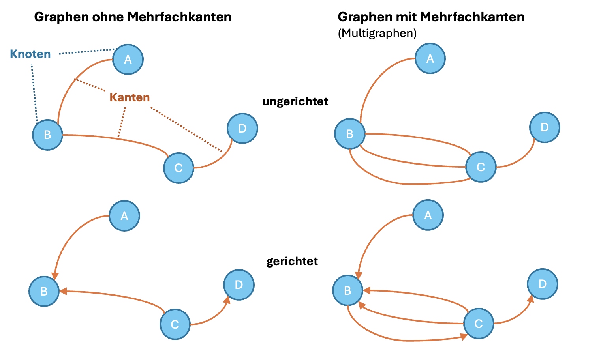

- Graphen ohne Mehrfachkanten:
    - Diese Graphen erlauben pro Knotenpaar maximal eine Kante. 
    - Die Verbindungen können dabei gerichtet oder ungerichtet sein. 
- Graphen mit Mehrfachkanten (Multigraphen):
    - Hier können mehrere Kanten zwischen denselben Knoten existieren, die unterschiedliche Relationen oder mehrfach vorkommende Transaktionen darstellen. 
    - Multigraphen können ebenfalls ungerichtet oder gerichtet sein. 

> Beispiel: Ein ungerichteter Graph zeigt eine soziale Verbindung, etwa Freundschaften, während ein gerichteter Graph Transaktionen oder Flüsse zwischen Konten darstellt.

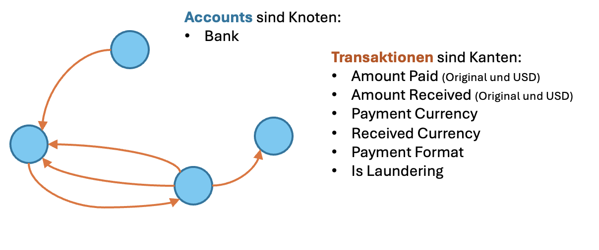
In unserem spezifischen Anwendungsfall zur Geldwäsche-Erkennung wählen wir ein gerichtetes Multigraph-Modell. In diesem Modell repräsentieren die Knoten Bankkonten, während die Kanten Transaktionen zwischen diesen Konten darstellen. Da zwischen zwei Konten mehrere Transaktionen stattfinden können, eignet sich ein Multigraph hervorragend, um diese Dynamik zu modellieren. Die Kanten unseres Graphen sind dabei nicht nur einfache Verbindungen, sondern tragen zusätzliche Informationen in Form von Attributen. Dazu gehören der Betrag der Transaktion in Original- und USD-Währung, die verwendete Währung, das Zahlungsformat und ein Indikator, ob die Transaktion verdächtig ist oder nicht. 

### Data-Split
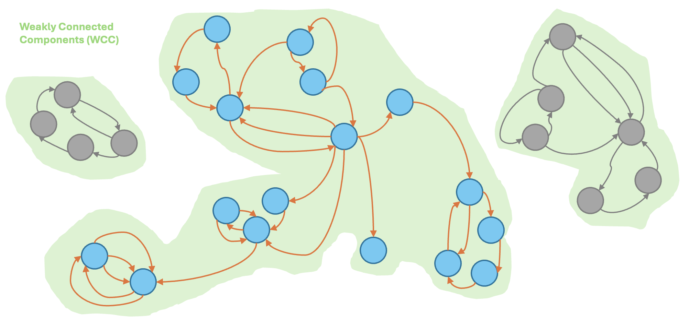
Um die Daten sauber für Training und Evaluierung zu trennen, nutzen wir einen Community Split. Dieser Ansatz stellt sicher, dass die Datensätze vollständig getrennt bleiben und keine Informationen zwischen ihnen fliessen. So verhindern wir effektiv Data Leakage – das unbeabsichtigte Übertragen von Informationen zwischen Trainings-, Validierungs- und Testdaten. Zunächst wandelten wir die tabellarischen Daten, wie im vorherigen Kapitel beschrieben, in einen Graphen um. Danach bestimmten wir die grösste Weakly Connected Component (WCC), also den grössten Teilgraphen, in dem alle Knoten unabhängig von der Kantenrichtung verbunden sind. Dadurch bleibt der Graph konsistent und zusammenhängend. In unserem Fall umfasst die WCC 371'917 Konten und 1'496'497 Transaktionen – das entspricht 72% aller Konten, aber nur 29% der Transaktionen. Vermutlich liegt das daran, dass viele Konten laut unserer Analyse nur eine oder zwei Transaktionen tätigen oder empfangen. Der Anteil betrügerischer Transaktionen im WCC beträgt 0.66% statt nur 0.1%.

Im nächsten Schritt teilen wir die Knoten mit dem Louvain-Algorithmus in Gruppen (Communities) ein. Dieser Algorithmus erkennt effizient Communities in grossen Netzwerken, indem er iterativ die Modularity maximiert – ein Mass für die Konzentration der Kanten innerhalb einer Community im Vergleich zu Kanten zwischen verschiedenen Communities. Der Louvain-Algorithmus hat zwei Phasen: Zuerst gruppiert er die Knoten einzeln in vorläufige Communities, um die Modularity lokal zu verbessern. Danach fasst er diese Communities zu Superknoten zusammen und wendet den Algorithmus rekursiv auf der neuen Graphenstruktur an. Dies wiederholt sich, bis sich die Modularity nicht weiter steigern lässt. 
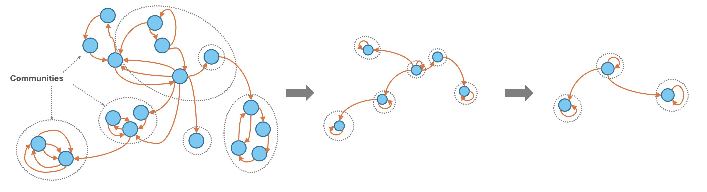

Um die beste Community-Einteilung zu erreichen, prüfen wir in einer Schleife mehrere Varianten. Wir wollen die Zahl der durchtrennten Fraud-Kanten (betrügerische Transaktionen) minimieren und gleichzeitig die Knotenverteilung in den Splits im Verhältnis von 60% Training, 20% Validierung und 20% Test halten. Dieses Vorgehen ist entscheidend, um die Balance zwischen realistischen Szenarien und statistischer Robustheit zu wahren. Im Trainingsset liegt der Anteil betrügerischer Transaktionen bei 0.71%, wodurch er im Validierungs- und Testset auf 0.13% sinkt.

Abschliessend übernehmen wir nur die Kanten in die jeweiligen Splits, die zwischen Knoten desselben Splits existieren. So bleibt die Trennung der Daten gewährleistet und die Integrität der Community-Struktur erhalten.

### Die Modelle detailliert

#### Graph Feature Preprocessor (GFP)
Die beschriebene Graphstruktur bildet das Fundament des GFP. Er extrahiert graphbasierte Merkmale, die ein Modell nutzen kann. 
Ein entscheidender Vorteil des GFP ist seine Fähigkeit, dynamische Graphen zu verwalten. Da Transaktionen nur zeitweise relevant sind, arbeitet der GFP mit einem gleitenden Zeitfenster: Er fügt neue Transaktionen hinzu und entfernt veraltete Daten. So bleibt der Graph übersichtlich und spiegelt stets den aktuellen Zustand des Transaktionsnetzwerks wider. Ein weiteres Kernelement des GFP ist seine Fähigkeit, typische Muster wie Zyklen oder Scatter-Gather-Strukturen in Transaktionsnetzwerken zu erkennen. Der GFP übersetzt diese Muster in numerische Merkmale, die er in das Datenset integriert. Diese Merkmale bereichern die Daten und liefern maschinellen Lernmodellen zusätzliche Informationen für fundierte Entscheidungen. 

> Beispiel aus unserem Anwendungsfall: Ein Konto führt mehrere Transaktionen durch, die einen Zyklus bilden, etwa A → B → C → A. Der GFP erkennt dieses Muster und berechnet die Anzahl der Zyklen, an denen Konto A beteiligt ist. Diese Information fügt er dem Datenset hinzu, damit ein maschinelles Lernmodell besser einschätzen kann, ob dieses Konto verdächtig ist.

Wir nutzen die GFP-Daten unbalanciert und wenden die vier oben beschriebenen Sampling-Methoden an.

#### Graph-basierte neuronale Netzwerke (GNNs) allgemein

Graph-basierte neuronale Netzwerke (GNNs) ähneln klassischen neuronalen Netzwerken, unterscheiden sich jedoch grundlegend: Klassische Netzwerke verarbeiten Daten wie Bilder oder Töne in fester Reihenfolge, während Graphen keine solche Ordnung besitzen. Sie sind flexibel, ohne klaren Anfang oder Endpunkt. GNNs lösen dieses Problem, indem sie jeden Knoten als eigenständiges Netzwerk behandeln, das Informationen von Nachbarn aufnimmt und die Graphenstruktur berücksichtigt. Anders als klassische Netzwerke nutzen Knoten in einem GNN eine gemeinsame Gewichtsmatrix. Diese geteilten Gewichte ermöglichen es dem Modell, universelle Muster zu lernen, die auf alle Knoten anwendbar sind, unabhängig von deren Position oder Rolle im Graphen. Diese Methode eignet sich besonders für Aufgaben wie die Betrugserkennung, bei denen dieselben Regeln, etwa für verdächtige Transaktionen, auf alle Knoten übertragbar sind.

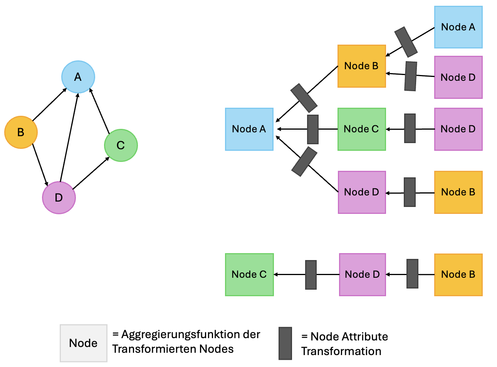

Das Bild zeigt links einen gerichteten Graphen und rechts die neuronalen Netzwerke für zwei Zielknoten: Node A (oben) und Node C (unten). 

Links: Der gerichtete Graph verbindet die Knoten A, B, C und D mit gerichteten Kanten. Informationen fliessen nur in Pfeilrichtung. A empfängt Daten von B, C und D, während C nur von D Informationen erhält. 

Rechts: Verarbeitung in einem GNN. Hier sieht man, wie ein GNN die Informationen der Nachbarknoten eines Zielknotens (z. B. A oder C) verarbeitet: 
- Node A (oben): A erhält Informationen von B, C und D. Jeder Nachbarknoten wird einzeln transformiert (dunkelgraue Rechtecke). Danach aggregiert man die transformierten Daten (weisse Quadrate), um die Merkmale von A zu aktualisieren. 
- Node C (unten): C erhält nur Informationen von D. Auch hier transformiert man die Nachbarattribute, aggregiert sie und aktualisiert die Merkmale von C.

Im Detail läuft die Verarbeitung in einem GNN folgendermassen: 

**Schritt 1: Transformation der Nachbarn**: 
Jeder Knoten sammelt Informationen aus seiner Umgebung. In unserem Beispiel erhält Knoten A Daten von B, C und D. Bevor diese Daten weiterfliessen, transformiert man sie einzeln, um sie nützlicher zu machen. Eine Gewichtsmatrix (eine Art Filter) und eine Aktivierungsfunktion heben dabei wichtige Merkmale hervor. Im Bild symbolisieren die dunkelgrauen Rechtecke diesen Prozess. 

Beispiel: Jeder Nachbar enthält Informationen über eine Transaktion, etwa die Höhe des Betrags. 
- Node B: Transaktionsbetrag = 100
- Node C: Transaktionsbetrag = 200
- Node D: Transaktionsbetrag = 150

Die Gewichtsmatrix könnte die Beträge so anpassen, dass sie je nach ihrer Bedeutung für die Analyse stärker oder schwächer gewichtet werden.

**Schritt 2: Nachbarschaftsdaten zusammenfassen**
Sobald die Nachbardaten umgewandelt sind, fassen wir sie zu einer einzigen Information zusammen. Diese Zusammenfassung vereint alle Nachbardaten in einem Wert. Häufige Methoden sind: 
- Summe: Wir addieren die umgewandelten Daten. 
- Mittelwert: Wir berechnen den Durchschnitt der Daten. 
- Max-Pooling: Wir wählen den höchsten Wert aus. 

In unserem Beispiel könnte die Aggregation so aussehen:
- Transformierte Beträge: B = 50, C = 100, D = 75
- Aggregation (Summe): 50 + 100 + 75 = 225
Im Bild zeigen die weissen Quadrate den Teil, der die Transformation darstellt.

**Schritt 3: Aktualisierung des Zielknotens**
Nach der Aggregation aktualisiert das GNN die Merkmale des Zielknotens. Es kombiniert die ursprünglichen Merkmale des Knotens mit den gesammelten Informationen seiner Nachbarn. So wird der Knoten „intelligenter“, indem er nicht nur seine eigenen Attribute, sondern auch die seiner Umgebung einbezieht. 

Beispiel: Node A hat ursprünglich den Wert 10. Nach der Aggregation der Nachbardaten (225) erhält A den neuen Wert 235.

#### Graph Isomorphism Network (GIN)

Das Graph Isomorphism Network (GIN) zielt darauf ab, die Leistungsfähigkeit des Weisfeiler-Lehman-Tests für Graph-Isomorphie zu erreichen. Dieser bewährte Algorithmus entscheidet, ob zwei Graphen strukturell identisch sind, und erkennt in neuen Daten verdächtige Muster, indem er subtile Unterschiede in Strukturen aufspürt. GIN verwendet eine robuste Summenaggregation statt Durchschnitts- oder Max-Pooling-Methoden und bezieht die Anzahl der Nachbarn direkt ein. So erkennt es feine Unterschiede in der Graphstruktur, was anderen Methoden oft misslingt. **Das Graph Convolutional Network (GCN)** etwa mittelt die Eigenschaften aller Knoten und gewichtet Nachbarinformationen gleichmässig, wodurch unterschiedliche Graphstrukturen ununterscheidbar werden können. Zwei Knoten mit verschieden vielen Nachbarn können ähnliche Merkmale zeigen, wenn ihre Durchschnittswerte gleich sind. Die **GraphSAGE-Methode** bietet Durchschnitt, Max-Pooling und LSTM-Pooling zur Auswahl, doch bleibt das Problem bestehen: Die Aggregation erfasst oft nicht die feinen Unterschiede zwischen Graphstrukturen. 

Nach der Summenaggregation verarbeitet ein neuronales Netzwerk (Multi-Layer Perceptron, MLP) das Ergebnis weiter und hilft dem Modell, komplexe Beziehungen und Muster im Graphen zu lernen. 
Ein weiterer Vorteil von GIN ist der Parameter ϵ, der die Gewichtung des Zielknotens gegenüber seinen Nachbarn flexibel steuert. So verhindert das Modell, dass alle Knoten zu ähnliche Repräsentationen erhalten, ein Problem, das als Over-Smoothing bekannt ist.

#### GINEConv von PyTorch 

In unserem Projekt verwenden wir das GINEConv-Layer aus der PyTorch-Geometric-Bibliothek, eine Weiterentwicklung des klassischen Graph Isomorphism Network (GIN). Anders als GIN berücksichtigt GINEConv nicht nur die Knotenmerkmale, sondern auch die Kanteninformationen, wie Beträge oder Währungen. Das macht es besonders geeignet für Aufgaben, bei denen die Verbindungen zwischen den Knoten entscheidend sind, etwa die Klassifikation von Kanten. Ein GIN-Modell würde in unserem Fall lediglich die Kontoeigenschaften analysieren, wie die Häufigkeit oder Höhe empfangener Transaktionen. GINEConv hingegen bezieht zusätzlich die Transaktionsmerkmale ein. So erkennt das Modell nicht nur die Anzahl der Transaktionen, sondern auch auffällige Beträge oder ungewöhnliche Verbindungen. Durch die Kombination von Knoten- und Kanteninformationen bietet GINEConv eine umfassendere Netzwerkanalyse und entdeckt verdächtige Muster, die rein knotenbasierte Modelle möglicherweise übersehen.

##### GINe
Unser GINe nutzt Edge-Updates und Batch-Normalisierung. Die **Edge-Updates** aktualisieren nicht nur die Knoteneigenschaften, sondern auch die Kantenattribute während des Trainings. Ein zusätzliches neuronales Netzwerk kombiniert dazu die Informationen von Quellknoten, Zielknoten und Kantenattributen. Das Ergebnis wird mit den ursprünglichen Kanteninformationen verrechnet, wodurch eine reichhaltigere Darstellung entsteht. Diese Funktion erweist sich als besonders wertvoll, wenn die Kantenattribute wichtige Zusatzinformationen liefern. Mit den Edge-Updates lernt das Modell, diese Kontextinformationen besser zu nutzen, was die Vorhersagequalität, etwa bei der Klassifikation von Transaktionen, deutlich steigert. 

Zusätzlich normalisiert jede Schicht die Knoteneigenschaften mithilfe der **Batch-Normalisierung**. So bleiben die Werte in einem stabilen Bereich, was den Trainingsprozess beschleunigt und Überanpassung (Overfitting) verringert. In einem komplexen Netzwerk mit vielen Schichten und variierenden Eingabedaten sorgt die Batch-Normalisierung für eine robuste und konsistente Leistung.

##### GINe2
Das Modell GINe2 erweitert seinen Vorgänger GINe um mehrere konfigurierbare Optionen wie Dropout, Batch-Normalisierung und Edge-Updates, die sich manuell ein- oder ausschalten lassen. Diese Flexibilität macht das Modell vielseitiger und erlaubt es, gezielt auf unterschiedliche Anforderungen bei Graphdaten einzugehen. Die wichtigste Neuerung ist das **Dropout**: Es deaktiviert während des Trainings zufällig Neuronen, um Überanpassung (Overfitting) zu verhindern. 
Ohne Dropout stuft das Modell etwa vor allem Transaktionen mit ungewöhnlich hohen Beträgen als verdächtig ein, da diese im Training oft als Betrug markiert wurden. Mit Dropout berücksichtigt es zusätzlich andere Merkmale wie die Anzahl der Transaktionen, die Währung oder die Verbindungsfrequenz zwischen bestimmten Konten. So erkennt es sowohl offensichtliche als auch versteckte Muster, etwa ein auffälliges Netzwerk kleiner, häufiger Zahlungen. Ist Dropout aktiviert, greift es sowohl bei der Verarbeitung der Kantenattribute als auch in den abschliessenden Schichten des Modells.

##### GINe3
Das GINe3-Modell erweitert frühere Versionen durch zusätzliche **Pre- und Post-Processing-Schichten**, welche die Knoteneigenschaften vor und nach der GNN-Verarbeitung gezielt verfeinern. 

Die Pre-Processing-Schicht bereitet die Rohdaten der Knoten in mehreren Schritten auf: Lineare Transformationen, Aktivierungsfunktionen wie ReLU (Rectified Linear Unit), Batch-Normalisierung und optional Dropout bringen die Eingangsdaten in eine Form, die optimal für die GNN-Verarbeitung geeignet ist. So werden beispielsweise Transaktionsbeträge skaliert oder normalisiert, um extreme Ausreisser wie ungewöhnlich hohe Summen zu dämpfen und die Werte in einen einheitlichen Bereich zu überführen. Nach der GNN-Verarbeitung entstehen aggregierte Merkmale, die Informationen aus Knoten und Kanten kombinieren. 

Im Post-Processing durchlaufen diese Merkmale weitere Schichten, um spezifische Muster zu erkennen. Stuft das Modell etwa ein Konto als "verdächtig" ein, weil es viele kleine Transaktionen empfängt, präzisiert das Post-Processing diese Einschätzung. Es berücksichtigt dabei Kontextinformationen wie die Häufigkeit ähnlicher Transaktionen oder die Bank der Absender.

# Resultate

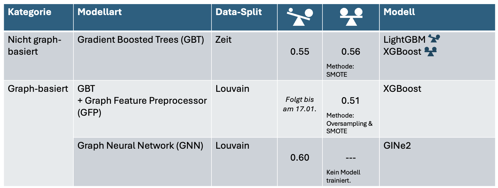

Die Grafik fasst die Ergebnisse der besten Modelle übersichtlich zusammen. Alle Modelle, ausser den GNN-Modellen, werden sowohl mit unbalancierten als auch mit balancierten Daten trainiert. Das GNN-Modell schneidet am besten ab und erreicht einen F1-Score von 0.60. Bemerkenswert ist, dass das nicht graphbasierte Modell XGBoost, trainiert mit nach der SMOTE-Methode gesampelten Daten, mit einem F1-Score von 0.56 fast gleichauf liegt. Die Ergebnisse sind solide, lassen aber viel Spielraum für Verbesserungen. Unsere Arbeit bietet einen ersten Einstieg in dieses Thema. Die Umsetzung bleibt ausbaufähig; konkrete Verbesserungsvorschläge finden sich im Kapitel „Outlook“.

## Nicht graph-basierte Modelle

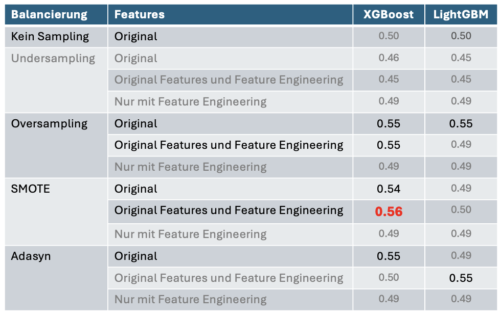

Die nicht-grafischen Modelle erreichen F1-Scores bis zu 0.56. Besonders XGBoost sticht hervor, da es oft über 0.5 liegt – ein Zeichen, dass das Modell tatsächlich lernt. Mit der Sampling-Methode SMOTE, den Originalmerkmalen und den manuell entwickelten Merkmalen, basierend auf den EDA-Erkenntnissen, erzielten wir das beste Ergebnis.

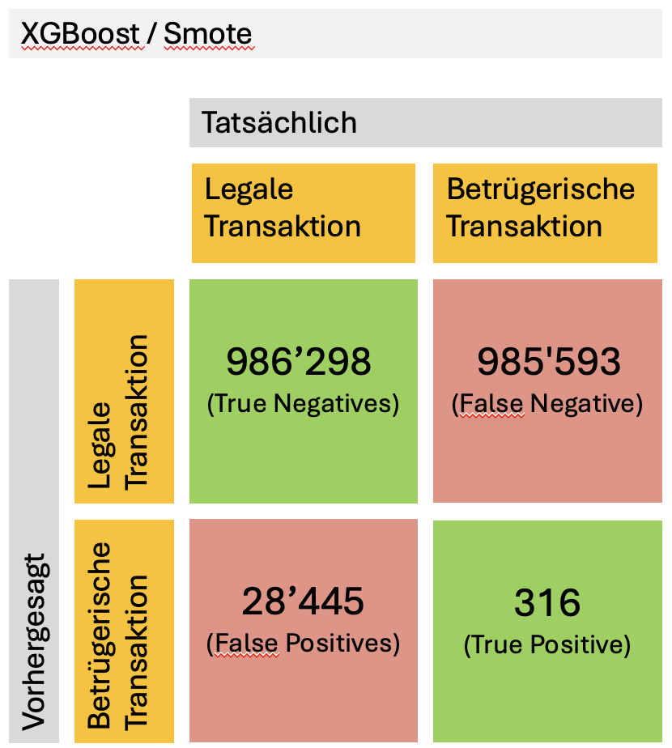

Die Grafik präsentiert die Confusion Matrix des besten Modells, XGBoost mit SMOTE. Durch das Sampling entstanden viele zusätzliche betrügerische Transaktionen. Das Modell stuft etwa 28'455 legale Transaktionen fälschlicherweise als betrügerisch ein, während es 985'593 betrügerische Transaktionen übersieht und als legal einordnet.

## Graph-basierte Modelle

### GFP

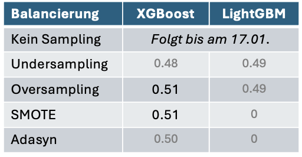

Die Modelle mit GFP-Features lieferten nicht die erhofften besseren Ergebnisse. Nur die XGBoost-Modelle durchbrachen mit den Sampling-Methoden Oversampling und SMOTE die 0.50-Marke. Ein F1-Score von 0.51 bleibt jedoch unbefriedigend. 

Wir haben zwei Thesen: 
- Erstens könnten Fehler im Code zur Generierung der GFP-Features vorliegen, besonders bei der Datensortierung. GFP erfordert zwingend eine zeitliche Sortierung der Daten. Dies sollte dringend überprüft werden. 
- Zweitens könnten die Sampling-Methoden die Mustererkennung beeinträchtigen. Die Features basieren auf der Graph-Struktur. Möglicherweise gelingt es den Sampling-Methoden nicht, diese erfolgreich nachzubilden. Diese These betrifft jedoch nur SMOTE und Adasyn, da Undersampling die Daten nicht verändert und Oversampling sie lediglich dupliziert.

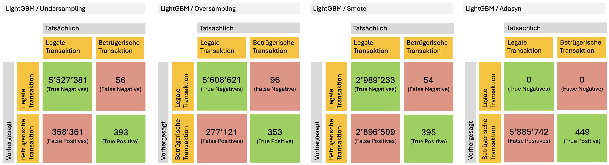

Die Confusion-Matrizen des Modells LightGBM zeigen klare Unterschiede. Mit der Sampling-Methode Adasyn sagt das Modell alle betrügerischen Transaktionen korrekt voraus, stuft jedoch zugleich alle legalen Transaktionen als betrügerisch ein. Bei SMOTE bleibt das Problem bestehen: Das Modell erkennt zwar einige betrügerische Transaktionen nicht, markiert aber immer noch die Hälfte der legalen Transaktionen fälschlich als betrügerisch. Undersampling und Oversampling liefern ähnliche Ergebnisse. Bei beiden Methoden klassifiziert das Modell nur etwa 10 bis 15 Prozent der legalen Transaktionen falsch.

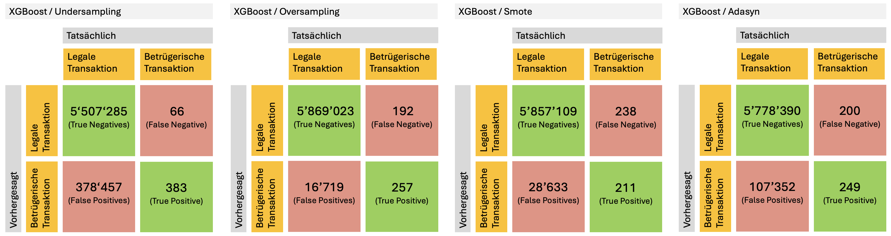

Die Confusion-Matrizen des Modells XGBoost weichen stark von denen von LightGBM ab. Ein wesentlicher Unterschied: XGBoost stuft deutlich mehr betrügerische Transaktionen fälschlicherweise als legal ein. Gleichzeitig klassifiziert es weniger legale Transaktionen irrtümlich als betrügerisch.

### GINe

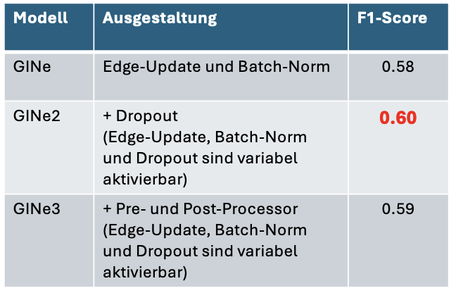

Die GNN Modelle steigern sich mit zunehmender Modell-Komplexität. Alle Modelle werden auf den unbalancierten Daten trainiert. Das Baseline-Modell erzielt dabei einen F1-Score von 0.58 und das beste Modell GINe2 von 0.6. Das verfeinerte Modell GINe3 mag sich nicht mehr weiter verbessern. 

# Outlook

Unsere Arbeit stellt eine Grundlage dar, um erste Berührungen mit graph-basierten Ansätzen zu schaffen. Als Basisarbeit bietet sie  Einblicke in die Stärken und Herausforderungen solcher Ansätze, doch gleichzeitig erkennen wir, dass unsere Modelle noch nicht annähernd an die konzeptionellen Überlegungen und Komplexität der in der Literatur vorgestellten Methoden heranreichen. Hierfür hätten wir unsere Arbeit nochmal stark überarbeiten müssen. Hierfür wäre auch die frühzeitige Planung und Sicherstellung ausreichender Rechenressourcen relevant. Die graph-basierten Ansätze GFP und GNN erfordern erhebliche Rechenkapazitäten. Wir wollten etwa die mit dem GFP generierten Features auch noch mit einem GINe-Modell trainieren und entschieden, dass dies in dieser Konstellation nicht möglich ist, da bereits XGBoost und LightGBM zur totalen Auslastung des Servers führte. 

Ein zentraler Faktor, der den Fortschritt unseres Projekts beeinflusst hat, war der Aufwand für das technische Setup. Besonders der Einsatz des Graph Preprocessors von SnapML stellte uns vor eine Herausforderung. Die fehlende Kompabilität für Windows und moderne Apple-Architekturen, verlangten die Einrichtung einer Multi-Linux-Umgebung in Docker. Viel Zeit ging hier für die Konfiguration und Fehlerbehebung verloren, die wir besser in die Modellentwicklung hätten investieren können.

Um die Leistung der Modelle zu steigern, empfehlen wir folgende Massnahmen: 

Allgemein: 
- Gezielte Merkmalsauswahl: Wählen Sie präzise die wichtigsten Merkmale aus, um die Modellkomplexität zu verringern und die Generalisierungsfähigkeit zu erhöhen. 
- Erweiterte Datenanalyse: Führen Sie zusätzliche Analysen durch, um neue, bisher ungenutzte Merkmale zu entdecken, die für die Modellierung wertvoll sind. 

LightGBM: 
- Anpassung des Parameters scale_pos_weight: Justieren Sie diesen Parameter, um das Klassenungleichgewicht im Datensatz besser auszugleichen und die Erkennung seltener Klassen zu verbessern. 
- Benutzerdefinierte Verlustfunktion: Implementieren Sie eine fokussierte Verlustfunktion wie Focal Loss, um schwer zu klassifizierende Instanzen stärker zu gewichten und die Modellleistung bei unbalancierten Daten zu erhöhen. 

GINe: 
- Führe ein breiteres Hyperparameter-Tuning durch. Diese Anpassung, deren Code bereits existiert, wurde aus Zeitgründen bisher nicht weiter untersucht. 
- Fortschrittliche Aggregationsmethoden: Nutzen Sie moderne Modelle wie PNA (Principal Neighbourhood Aggregation), um die Fähigkeit des Netzwerks zu verbessern, komplexe Graphstrukturen darzustellen. 
- Integration von GFP-Features: Verwenden Sie Graph Fingerprints (GFP), um wiederkehrende Muster in der Graphstruktur zu erkennen und die Trennschärfe des Modells zu steigern. 
- Wechsel der Zielvariable: Stellen Sie von Edge Classification auf Node Classification um, um eine alternative Perspektive auf den Graphen zu gewinnen. Diese Anpassung, deren Code bereits existiert, wurde aus Zeitgründen bisher nicht weiter untersucht. 
- Sampling-Methoden: Wenden Sie Techniken wie SMOTE oder Random Undersampling auf das GIN-Modell an, um die Leistung zu verbessern. Erste Ergebnisse zeigen, dass dies ein vielversprechender Ansatz ist.

# Quellen

Altman, E., Blanuša, J., von Niederhäusern, L., Egressy, B., Anghel, A., & Atasu, K. (2024). *Realistic Synthetic Financial Transactions for Anti-Money Laundering Models.* 37th Conference on Neural Information Processing Systems (NeurIPS). arXiv:2306.16424 

Blanuša, J., Cravero Baraja, M., Anghel, A., von Niederhäusern, L., Altman, E., Pozidis, H., & Atasu, K. (2024). *Graph Feature Preprocessor: Real-time Subgraph-based Feature Extraction for Financial Crime Detection.* ACM ICAIF 2024. arXiv:2402.08593 

Egressy, B., von Niederhäusern, L., Blanuša, J., Altman, E., Wattenhofer, R., & Atasu, K. (2024). *Provably Powerful Graph Neural Networks for Directed Multigraphs.* AAAI 2024. arXiv:2306.11586 

Liu, Z., Dou, Y., Yu, P. S., Deng, Y., & Peng, H. (2020). *Alleviating the Inconsistency Problem of Applying Graph Neural Network to Fraud Detection.* Proceedings of the 43rd International ACM SIGIR Conference on Research and Development in Information Retrieval. [https://doi.org/10.1145/3397271.3401253](https://doi.org/10.1145/3397271.3401253)

PyTorch Geometric. (n.d.). torch_geometric.nn.conv.GINEConv. PyTorch Geometric Documentation. [https://pytorch-geometric.readthedocs.io/en/2.5.1/generated/torch_geometric.nn.conv.GINEConv.html](https://pytorch-geometric.readthedocs.io/en/2.5.1/generated/torch_geometric.nn.conv.GINEConv.html)

Sinayobye, J. O., Kiwanuka, F., & Kaawaase Kyanda, S. (2018). *A State-of-the-Art Review of Machine Learning Techniques for Fraud Detection Research.* SEIA 2018. [https://doi.org/10.1145/3195528.3195534](https://doi.org/10.1145/3195528.3195534) 

Stanford University. (n.d.). CS229: Machine Learning (Autumn 2018) [Playlist]. YouTube. [https://www.youtube.com/playlist?list=PLoROMvodv4rPLKxIpqhjhPgdQy7imNkDn](https://www.youtube.com/playlist?list=PLoROMvodv4rPLKxIpqhjhPgdQy7imNkDn)

Vashistha, A., & Tiwari, A. K. (2024). *Building Resilience in Banking Against Fraud with Hyper Ensemble Machine Learning and Anomaly Detection Strategies.* SN Computer Science, 5(556). [https://doi.org/10.1007/s42979-024-02854-w](https://doi.org/10.1007/s42979-024-02854-w)